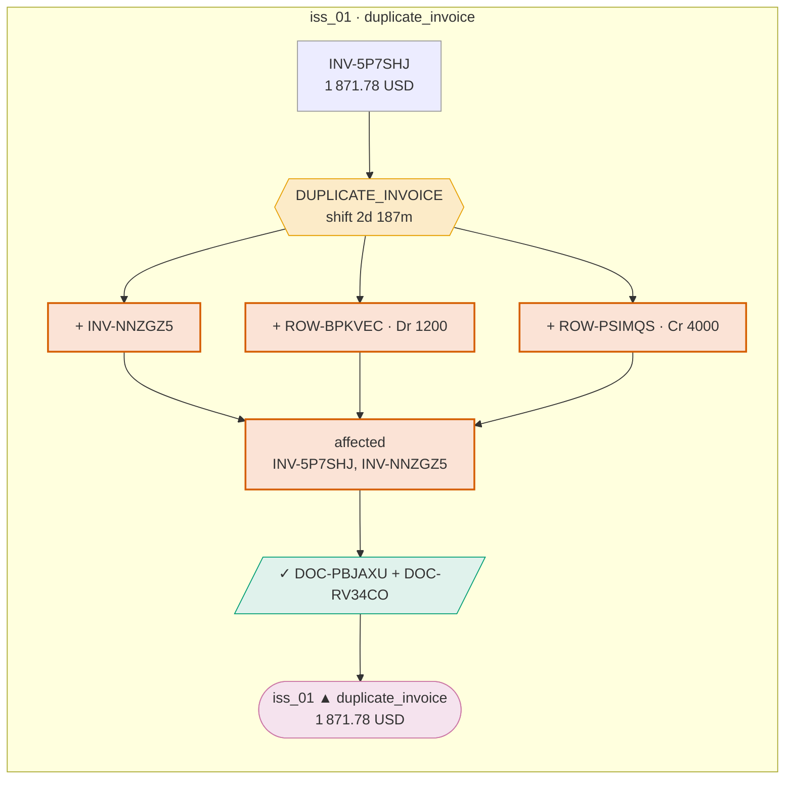
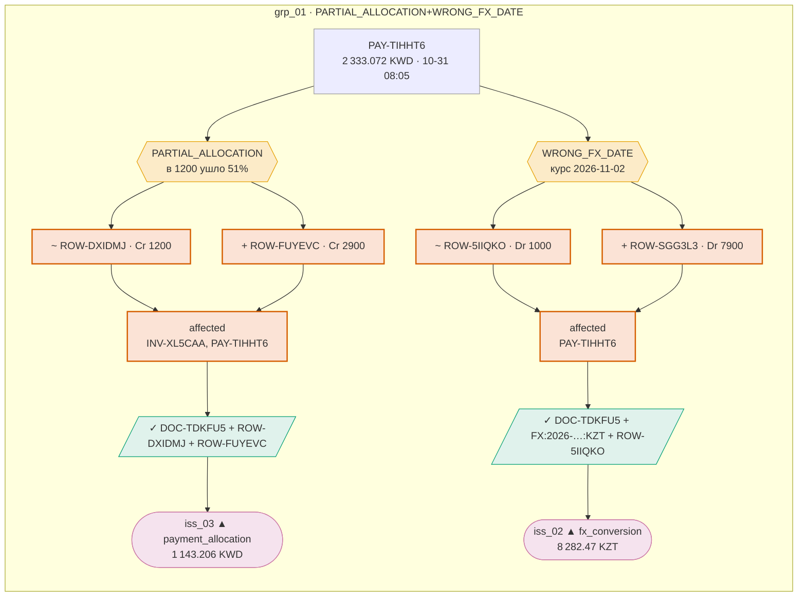
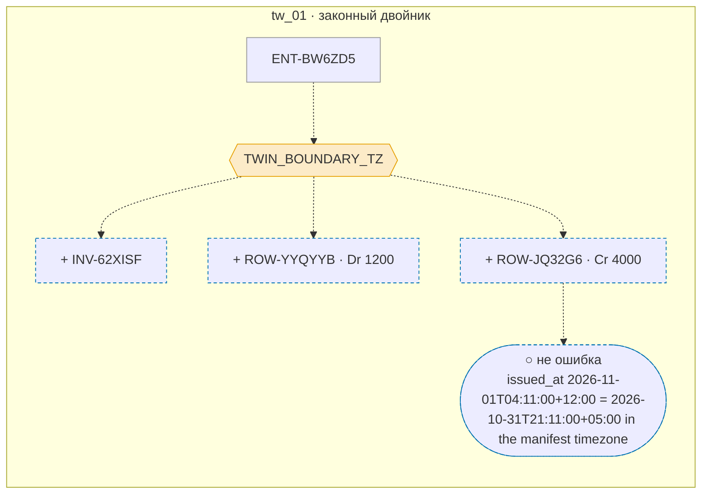

### iss_01 · duplicate_invoice (эпизод ep_4a3229fb)

```mermaid
flowchart LR
    classDef clean stroke:#999999
    classDef mut fill:#FCEBC8,stroke:#E69F00
    classDef err fill:#FBE3D6,stroke:#D55E00,stroke-width:2px
    classDef ev fill:#E0F2EC,stroke:#009E73
    classDef truth fill:#F5E3EE,stroke:#CC79A7
    classDef twin stroke:#0072B2,stroke-dasharray:4 3

    subgraph iss_01["iss_01 · duplicate_invoice"]
        iss_01_source_0["INV-5P7SHJ<br/>1 871.78 USD"]:::clean
        iss_01_mutator_0{{"DUPLICATE_INVOICE<br/>shift 2d 187m"}}:::mut
        iss_01_diff_0["+ INV-NNZGZ5"]:::err
        iss_01_diff_1["+ ROW-BPKVEC · Dr 1200"]:::err
        iss_01_diff_2["+ ROW-PSIMQS · Cr 4000"]:::err
        iss_01_affected_0["affected<br/>INV-5P7SHJ, INV-NNZGZ5"]:::err
        iss_01_evidence_0[/"✓ DOC-PBJAXU + DOC-RV34CO"/]:::ev
        iss_01_truth_0(["iss_01 ▲ duplicate_invoice<br/>1 871.78 USD"]):::truth
        iss_01_source_0 --> iss_01_mutator_0
        iss_01_mutator_0 --> iss_01_diff_0
        iss_01_mutator_0 --> iss_01_diff_1
        iss_01_mutator_0 --> iss_01_diff_2
        iss_01_diff_0 --> iss_01_affected_0
        iss_01_diff_1 --> iss_01_affected_0
        iss_01_diff_2 --> iss_01_affected_0
        iss_01_affected_0 --> iss_01_evidence_0
        iss_01_evidence_0 --> iss_01_truth_0
    end
```

### grp_01 · PARTIAL_ALLOCATION+WRONG_FX_DATE (эпизод ep_c60c70fc)

```mermaid
flowchart LR
    classDef clean stroke:#999999
    classDef mut fill:#FCEBC8,stroke:#E69F00
    classDef err fill:#FBE3D6,stroke:#D55E00,stroke-width:2px
    classDef ev fill:#E0F2EC,stroke:#009E73
    classDef truth fill:#F5E3EE,stroke:#CC79A7
    classDef twin stroke:#0072B2,stroke-dasharray:4 3

    subgraph grp_01["grp_01 · PARTIAL_ALLOCATION+WRONG_FX_DATE"]
        grp_01_source_0["PAY-TIHHT6<br/>2 333.072 KWD · 10-31 08:05"]:::clean
        grp_01_mutator_0{{"PARTIAL_ALLOCATION<br/>в 1200 ушло 51%"}}:::mut
        grp_01_diff_0["~ ROW-DXIDMJ · Cr 1200"]:::err
        grp_01_diff_1["+ ROW-FUYEVC · Cr 2900"]:::err
        grp_01_affected_0["affected<br/>INV-XL5CAA, PAY-TIHHT6"]:::err
        grp_01_evidence_0[/"✓ DOC-TDKFU5 + ROW-DXIDMJ + ROW-FUYEVC"/]:::ev
        grp_01_truth_0(["iss_03 ▲ payment_allocation<br/>1 143.206 KWD"]):::truth
        grp_01_mutator_1{{"WRONG_FX_DATE<br/>курс 2026-11-02"}}:::mut
        grp_01_diff_2["~ ROW-5IIQKO · Dr 1000"]:::err
        grp_01_diff_3["+ ROW-SGG3L3 · Dr 7900"]:::err
        grp_01_affected_1["affected<br/>PAY-TIHHT6"]:::err
        grp_01_evidence_1[/"✓ DOC-TDKFU5 + FX:2026-…:KZT + ROW-5IIQKO"/]:::ev
        grp_01_truth_1(["iss_02 ▲ fx_conversion<br/>8 282.47 KZT"]):::truth
        grp_01_source_0 --> grp_01_mutator_0
        grp_01_mutator_0 --> grp_01_diff_0
        grp_01_mutator_0 --> grp_01_diff_1
        grp_01_diff_0 --> grp_01_affected_0
        grp_01_diff_1 --> grp_01_affected_0
        grp_01_affected_0 --> grp_01_evidence_0
        grp_01_evidence_0 --> grp_01_truth_0
        grp_01_source_0 --> grp_01_mutator_1
        grp_01_mutator_1 --> grp_01_diff_2
        grp_01_mutator_1 --> grp_01_diff_3
        grp_01_diff_2 --> grp_01_affected_1
        grp_01_diff_3 --> grp_01_affected_1
        grp_01_affected_1 --> grp_01_evidence_1
        grp_01_evidence_1 --> grp_01_truth_1
    end
```

### tw_01 · законный двойник (эпизод ep_916ae572)

```mermaid
flowchart LR
    classDef clean stroke:#999999
    classDef mut fill:#FCEBC8,stroke:#E69F00
    classDef err fill:#FBE3D6,stroke:#D55E00,stroke-width:2px
    classDef ev fill:#E0F2EC,stroke:#009E73
    classDef truth fill:#F5E3EE,stroke:#CC79A7
    classDef twin stroke:#0072B2,stroke-dasharray:4 3

    subgraph tw_01["tw_01 · законный двойник"]
        tw_01_source_0["ENT-BW6ZD5"]:::clean
        tw_01_mutator_0{{"TWIN_BOUNDARY_TZ<br/>"}}:::mut
        tw_01_diff_0["+ INV-62XISF"]:::twin
        tw_01_diff_1["+ ROW-YYQYYB · Dr 1200"]:::twin
        tw_01_diff_2["+ ROW-JQ32G6 · Cr 4000"]:::twin
        tw_01_truth_0(["○ не ошибка<br/>issued_at 2026-11-01T04:11:00+12:00 = 2026-10-31T21:11:00+05:00 in the manifest timezone"]):::twin
        tw_01_source_0 -.-> tw_01_mutator_0
        tw_01_mutator_0 -.-> tw_01_diff_0
        tw_01_mutator_0 -.-> tw_01_diff_1
        tw_01_mutator_0 -.-> tw_01_diff_2
        tw_01_diff_2 -.-> tw_01_truth_0
    end
```
