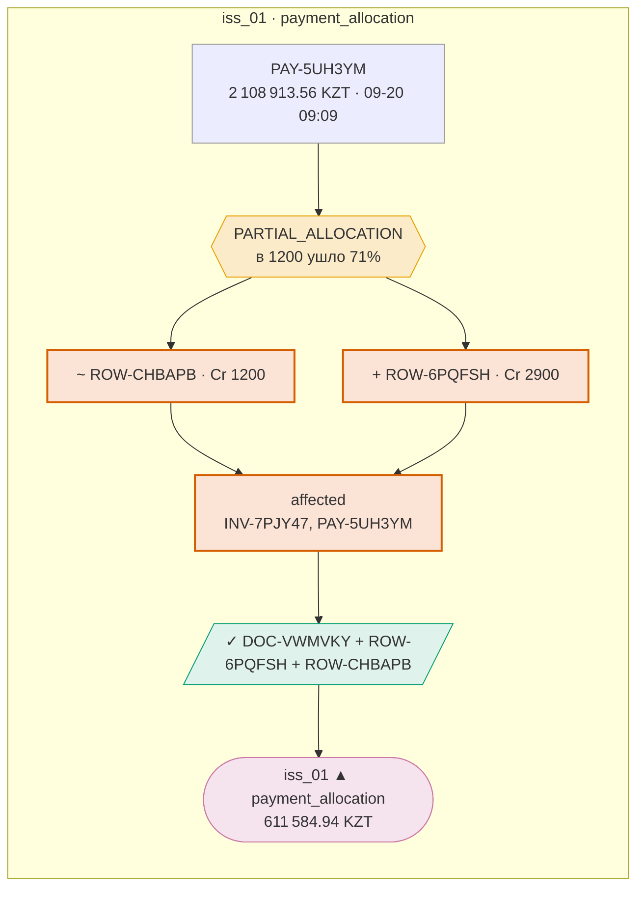
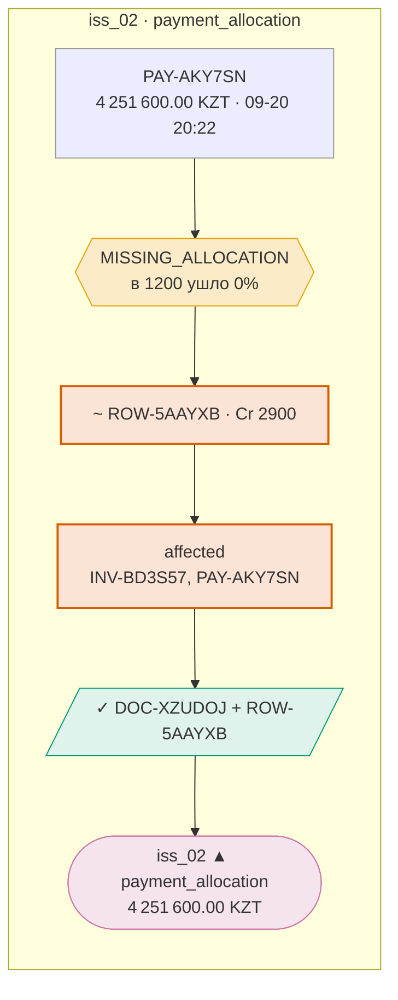
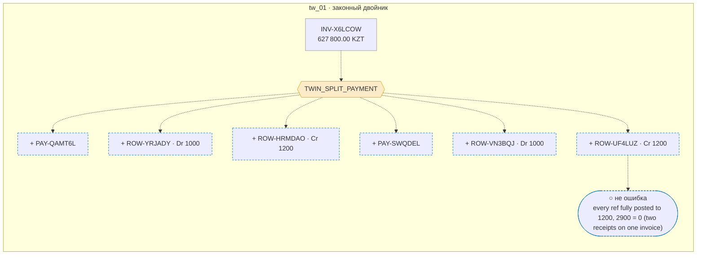

## Граф причинности · эпизод ep_1a97217c · 2 ошибок/групп · 1 двойников

```mermaid
flowchart LR
    classDef clean stroke:#999999
    classDef mut fill:#FCEBC8,stroke:#E69F00
    classDef err fill:#FBE3D6,stroke:#D55E00,stroke-width:2px
    classDef ev fill:#E0F2EC,stroke:#009E73
    classDef truth fill:#F5E3EE,stroke:#CC79A7
    classDef twin stroke:#0072B2,stroke-dasharray:4 3

    subgraph iss_01["iss_01 · payment_allocation"]
        iss_01_source_0["PAY-5UH3YM<br/>2 108 913.56 KZT · 09-20 09:09"]:::clean
        iss_01_mutator_0{{"PARTIAL_ALLOCATION<br/>в 1200 ушло 71%"}}:::mut
        iss_01_diff_0["~ ROW-CHBAPB · Cr 1200"]:::err
        iss_01_diff_1["+ ROW-6PQFSH · Cr 2900"]:::err
        iss_01_affected_0["affected<br/>INV-7PJY47, PAY-5UH3YM"]:::err
        iss_01_evidence_0[/"✓ DOC-VWMVKY + ROW-6PQFSH + ROW-CHBAPB"/]:::ev
        iss_01_truth_0(["iss_01 ▲ payment_allocation<br/>611 584.94 KZT"]):::truth
        iss_01_source_0 --> iss_01_mutator_0
        iss_01_mutator_0 --> iss_01_diff_0
        iss_01_mutator_0 --> iss_01_diff_1
        iss_01_diff_0 --> iss_01_affected_0
        iss_01_diff_1 --> iss_01_affected_0
        iss_01_affected_0 --> iss_01_evidence_0
        iss_01_evidence_0 --> iss_01_truth_0
    end
```

```mermaid
flowchart LR
    classDef clean stroke:#999999
    classDef mut fill:#FCEBC8,stroke:#E69F00
    classDef err fill:#FBE3D6,stroke:#D55E00,stroke-width:2px
    classDef ev fill:#E0F2EC,stroke:#009E73
    classDef truth fill:#F5E3EE,stroke:#CC79A7
    classDef twin stroke:#0072B2,stroke-dasharray:4 3

    subgraph iss_02["iss_02 · payment_allocation"]
        iss_02_source_0["PAY-AKY7SN<br/>4 251 600.00 KZT · 09-20 20:22"]:::clean
        iss_02_mutator_0{{"MISSING_ALLOCATION<br/>в 1200 ушло 0%"}}:::mut
        iss_02_diff_0["~ ROW-5AAYXB · Cr 2900"]:::err
        iss_02_affected_0["affected<br/>INV-BD3S57, PAY-AKY7SN"]:::err
        iss_02_evidence_0[/"✓ DOC-XZUDOJ + ROW-5AAYXB"/]:::ev
        iss_02_truth_0(["iss_02 ▲ payment_allocation<br/>4 251 600.00 KZT"]):::truth
        iss_02_source_0 --> iss_02_mutator_0
        iss_02_mutator_0 --> iss_02_diff_0
        iss_02_diff_0 --> iss_02_affected_0
        iss_02_affected_0 --> iss_02_evidence_0
        iss_02_evidence_0 --> iss_02_truth_0
    end
```

```mermaid
flowchart LR
    classDef clean stroke:#999999
    classDef mut fill:#FCEBC8,stroke:#E69F00
    classDef err fill:#FBE3D6,stroke:#D55E00,stroke-width:2px
    classDef ev fill:#E0F2EC,stroke:#009E73
    classDef truth fill:#F5E3EE,stroke:#CC79A7
    classDef twin stroke:#0072B2,stroke-dasharray:4 3

    subgraph tw_01["tw_01 · законный двойник"]
        tw_01_source_0["INV-X6LCOW<br/>627 800.00 KZT"]:::clean
        tw_01_mutator_0{{"TWIN_SPLIT_PAYMENT<br/>"}}:::mut
        tw_01_diff_0["+ PAY-QAMT6L"]:::twin
        tw_01_diff_1["+ ROW-YRJADY · Dr 1000"]:::twin
        tw_01_diff_2["+ ROW-HRMDAO · Cr 1200"]:::twin
        tw_01_diff_3["+ PAY-SWQDEL"]:::twin
        tw_01_diff_4["+ ROW-VN3BQJ · Dr 1000"]:::twin
        tw_01_diff_5["+ ROW-UF4LUZ · Cr 1200"]:::twin
        tw_01_truth_0(["○ не ошибка<br/>every ref fully posted to 1200, 2900 = 0 (two receipts on one invoice)"]):::twin
        tw_01_source_0 -.-> tw_01_mutator_0
        tw_01_mutator_0 -.-> tw_01_diff_0
        tw_01_mutator_0 -.-> tw_01_diff_1
        tw_01_mutator_0 -.-> tw_01_diff_2
        tw_01_mutator_0 -.-> tw_01_diff_3
        tw_01_mutator_0 -.-> tw_01_diff_4
        tw_01_mutator_0 -.-> tw_01_diff_5
        tw_01_diff_5 -.-> tw_01_truth_0
    end
```
