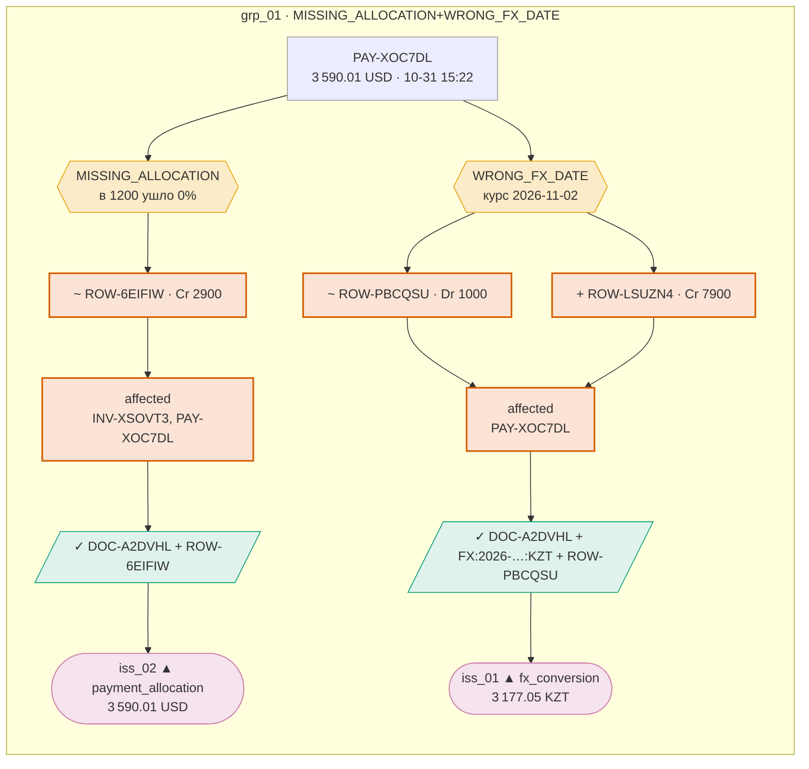
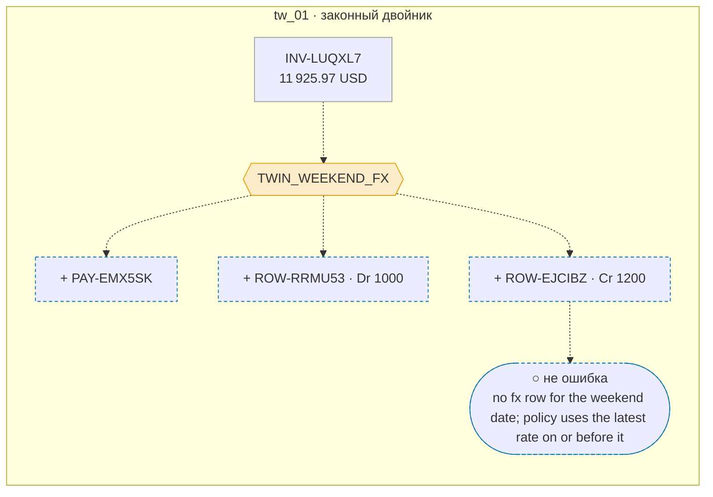

## Граф причинности · эпизод ep_2e424236 · 1 ошибок/групп · 1 двойников

```mermaid
flowchart LR
    classDef clean stroke:#999999
    classDef mut fill:#FCEBC8,stroke:#E69F00
    classDef err fill:#FBE3D6,stroke:#D55E00,stroke-width:2px
    classDef ev fill:#E0F2EC,stroke:#009E73
    classDef truth fill:#F5E3EE,stroke:#CC79A7
    classDef twin stroke:#0072B2,stroke-dasharray:4 3

    subgraph grp_01["grp_01 · MISSING_ALLOCATION+WRONG_FX_DATE"]
        grp_01_source_0["PAY-XOC7DL<br/>3 590.01 USD · 10-31 15:22"]:::clean
        grp_01_mutator_0{{"MISSING_ALLOCATION<br/>в 1200 ушло 0%"}}:::mut
        grp_01_diff_0["~ ROW-6EIFIW · Cr 2900"]:::err
        grp_01_affected_0["affected<br/>INV-XSOVT3, PAY-XOC7DL"]:::err
        grp_01_evidence_0[/"✓ DOC-A2DVHL + ROW-6EIFIW"/]:::ev
        grp_01_truth_0(["iss_02 ▲ payment_allocation<br/>3 590.01 USD"]):::truth
        grp_01_mutator_1{{"WRONG_FX_DATE<br/>курс 2026-11-02"}}:::mut
        grp_01_diff_1["~ ROW-PBCQSU · Dr 1000"]:::err
        grp_01_diff_2["+ ROW-LSUZN4 · Cr 7900"]:::err
        grp_01_affected_1["affected<br/>PAY-XOC7DL"]:::err
        grp_01_evidence_1[/"✓ DOC-A2DVHL + FX:2026-…:KZT + ROW-PBCQSU"/]:::ev
        grp_01_truth_1(["iss_01 ▲ fx_conversion<br/>3 177.05 KZT"]):::truth
        grp_01_source_0 --> grp_01_mutator_0
        grp_01_mutator_0 --> grp_01_diff_0
        grp_01_diff_0 --> grp_01_affected_0
        grp_01_affected_0 --> grp_01_evidence_0
        grp_01_evidence_0 --> grp_01_truth_0
        grp_01_source_0 --> grp_01_mutator_1
        grp_01_mutator_1 --> grp_01_diff_1
        grp_01_mutator_1 --> grp_01_diff_2
        grp_01_diff_1 --> grp_01_affected_1
        grp_01_diff_2 --> grp_01_affected_1
        grp_01_affected_1 --> grp_01_evidence_1
        grp_01_evidence_1 --> grp_01_truth_1
    end
```

```mermaid
flowchart LR
    classDef clean stroke:#999999
    classDef mut fill:#FCEBC8,stroke:#E69F00
    classDef err fill:#FBE3D6,stroke:#D55E00,stroke-width:2px
    classDef ev fill:#E0F2EC,stroke:#009E73
    classDef truth fill:#F5E3EE,stroke:#CC79A7
    classDef twin stroke:#0072B2,stroke-dasharray:4 3

    subgraph tw_01["tw_01 · законный двойник"]
        tw_01_source_0["INV-LUQXL7<br/>11 925.97 USD"]:::clean
        tw_01_mutator_0{{"TWIN_WEEKEND_FX<br/>"}}:::mut
        tw_01_diff_0["+ PAY-EMX5SK"]:::twin
        tw_01_diff_1["+ ROW-RRMU53 · Dr 1000"]:::twin
        tw_01_diff_2["+ ROW-EJCIBZ · Cr 1200"]:::twin
        tw_01_truth_0(["○ не ошибка<br/>no fx row for the weekend date; policy uses the latest rate on or before it"]):::twin
        tw_01_source_0 -.-> tw_01_mutator_0
        tw_01_mutator_0 -.-> tw_01_diff_0
        tw_01_mutator_0 -.-> tw_01_diff_1
        tw_01_mutator_0 -.-> tw_01_diff_2
        tw_01_diff_2 -.-> tw_01_truth_0
    end
```
