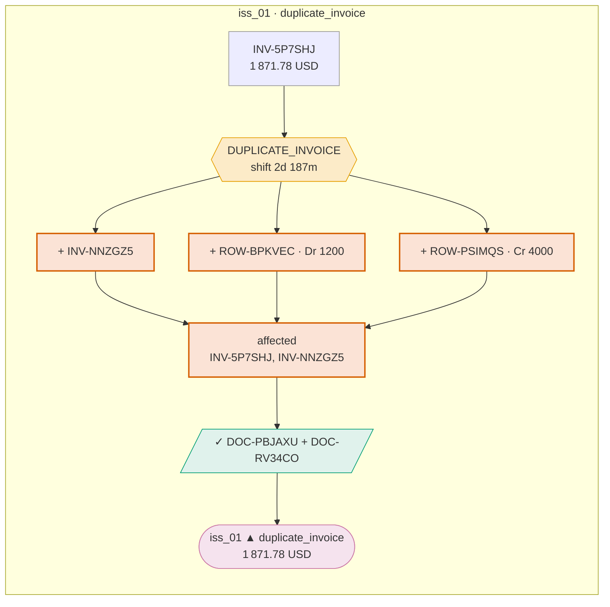
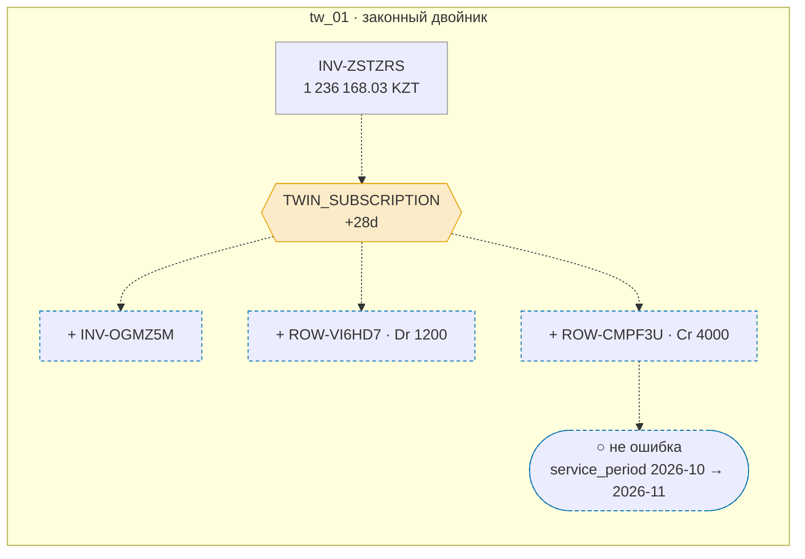

## Граф причинности · эпизод ep_4a3229fb · 1 ошибок/групп · 1 двойников

```mermaid
flowchart LR
    classDef clean stroke:#999999
    classDef mut fill:#FCEBC8,stroke:#E69F00
    classDef err fill:#FBE3D6,stroke:#D55E00,stroke-width:2px
    classDef ev fill:#E0F2EC,stroke:#009E73
    classDef truth fill:#F5E3EE,stroke:#CC79A7
    classDef twin stroke:#0072B2,stroke-dasharray:4 3

    subgraph iss_01["iss_01 · duplicate_invoice"]
        iss_01_source_0["INV-5P7SHJ<br/>1 871.78 USD"]:::clean
        iss_01_mutator_0{{"DUPLICATE_INVOICE<br/>shift 2d 187m"}}:::mut
        iss_01_diff_0["+ INV-NNZGZ5"]:::err
        iss_01_diff_1["+ ROW-BPKVEC · Dr 1200"]:::err
        iss_01_diff_2["+ ROW-PSIMQS · Cr 4000"]:::err
        iss_01_affected_0["affected<br/>INV-5P7SHJ, INV-NNZGZ5"]:::err
        iss_01_evidence_0[/"✓ DOC-PBJAXU + DOC-RV34CO"/]:::ev
        iss_01_truth_0(["iss_01 ▲ duplicate_invoice<br/>1 871.78 USD"]):::truth
        iss_01_source_0 --> iss_01_mutator_0
        iss_01_mutator_0 --> iss_01_diff_0
        iss_01_mutator_0 --> iss_01_diff_1
        iss_01_mutator_0 --> iss_01_diff_2
        iss_01_diff_0 --> iss_01_affected_0
        iss_01_diff_1 --> iss_01_affected_0
        iss_01_diff_2 --> iss_01_affected_0
        iss_01_affected_0 --> iss_01_evidence_0
        iss_01_evidence_0 --> iss_01_truth_0
    end
```

```mermaid
flowchart LR
    classDef clean stroke:#999999
    classDef mut fill:#FCEBC8,stroke:#E69F00
    classDef err fill:#FBE3D6,stroke:#D55E00,stroke-width:2px
    classDef ev fill:#E0F2EC,stroke:#009E73
    classDef truth fill:#F5E3EE,stroke:#CC79A7
    classDef twin stroke:#0072B2,stroke-dasharray:4 3

    subgraph tw_01["tw_01 · законный двойник"]
        tw_01_source_0["INV-ZSTZRS<br/>1 236 168.03 KZT"]:::clean
        tw_01_mutator_0{{"TWIN_SUBSCRIPTION<br/>+28d"}}:::mut
        tw_01_diff_0["+ INV-OGMZ5M"]:::twin
        tw_01_diff_1["+ ROW-VI6HD7 · Dr 1200"]:::twin
        tw_01_diff_2["+ ROW-CMPF3U · Cr 4000"]:::twin
        tw_01_truth_0(["○ не ошибка<br/>service_period 2026-10 → 2026-11"]):::twin
        tw_01_source_0 -.-> tw_01_mutator_0
        tw_01_mutator_0 -.-> tw_01_diff_0
        tw_01_mutator_0 -.-> tw_01_diff_1
        tw_01_mutator_0 -.-> tw_01_diff_2
        tw_01_diff_2 -.-> tw_01_truth_0
    end
```
