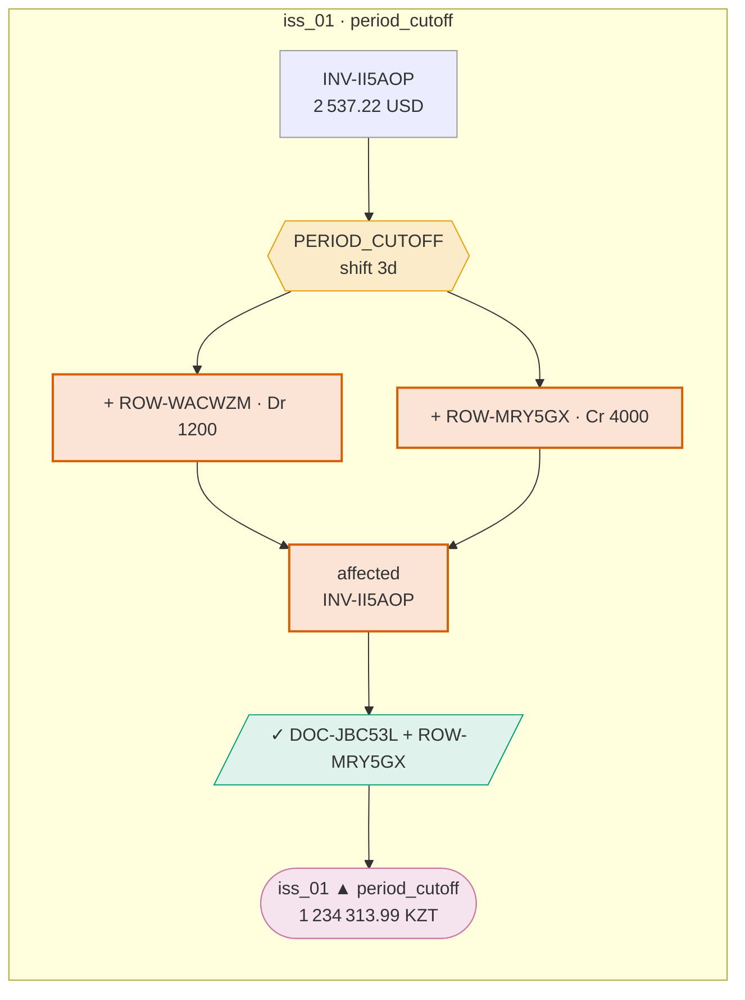
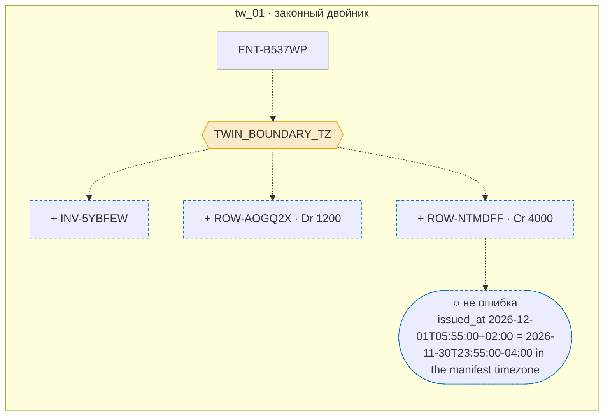

## Граф причинности · эпизод ep_8deb0df8 · 1 ошибок/групп · 1 двойников

```mermaid
flowchart LR
    classDef clean stroke:#999999
    classDef mut fill:#FCEBC8,stroke:#E69F00
    classDef err fill:#FBE3D6,stroke:#D55E00,stroke-width:2px
    classDef ev fill:#E0F2EC,stroke:#009E73
    classDef truth fill:#F5E3EE,stroke:#CC79A7
    classDef twin stroke:#0072B2,stroke-dasharray:4 3

    subgraph iss_01["iss_01 · period_cutoff"]
        iss_01_source_0["INV-II5AOP<br/>2 537.22 USD"]:::clean
        iss_01_mutator_0{{"PERIOD_CUTOFF<br/>shift 3d"}}:::mut
        iss_01_diff_0["+ ROW-WACWZM · Dr 1200"]:::err
        iss_01_diff_1["+ ROW-MRY5GX · Cr 4000"]:::err
        iss_01_affected_0["affected<br/>INV-II5AOP"]:::err
        iss_01_evidence_0[/"✓ DOC-JBC53L + ROW-MRY5GX"/]:::ev
        iss_01_truth_0(["iss_01 ▲ period_cutoff<br/>1 234 313.99 KZT"]):::truth
        iss_01_source_0 --> iss_01_mutator_0
        iss_01_mutator_0 --> iss_01_diff_0
        iss_01_mutator_0 --> iss_01_diff_1
        iss_01_diff_0 --> iss_01_affected_0
        iss_01_diff_1 --> iss_01_affected_0
        iss_01_affected_0 --> iss_01_evidence_0
        iss_01_evidence_0 --> iss_01_truth_0
    end
```

```mermaid
flowchart LR
    classDef clean stroke:#999999
    classDef mut fill:#FCEBC8,stroke:#E69F00
    classDef err fill:#FBE3D6,stroke:#D55E00,stroke-width:2px
    classDef ev fill:#E0F2EC,stroke:#009E73
    classDef truth fill:#F5E3EE,stroke:#CC79A7
    classDef twin stroke:#0072B2,stroke-dasharray:4 3

    subgraph tw_01["tw_01 · законный двойник"]
        tw_01_source_0["ENT-B537WP"]:::clean
        tw_01_mutator_0{{"TWIN_BOUNDARY_TZ<br/>"}}:::mut
        tw_01_diff_0["+ INV-5YBFEW"]:::twin
        tw_01_diff_1["+ ROW-AOGQ2X · Dr 1200"]:::twin
        tw_01_diff_2["+ ROW-NTMDFF · Cr 4000"]:::twin
        tw_01_truth_0(["○ не ошибка<br/>issued_at 2026-12-01T05:55:00+02:00 = 2026-11-30T23:55:00-04:00 in the manifest timezone"]):::twin
        tw_01_source_0 -.-> tw_01_mutator_0
        tw_01_mutator_0 -.-> tw_01_diff_0
        tw_01_mutator_0 -.-> tw_01_diff_1
        tw_01_mutator_0 -.-> tw_01_diff_2
        tw_01_diff_2 -.-> tw_01_truth_0
    end
```
