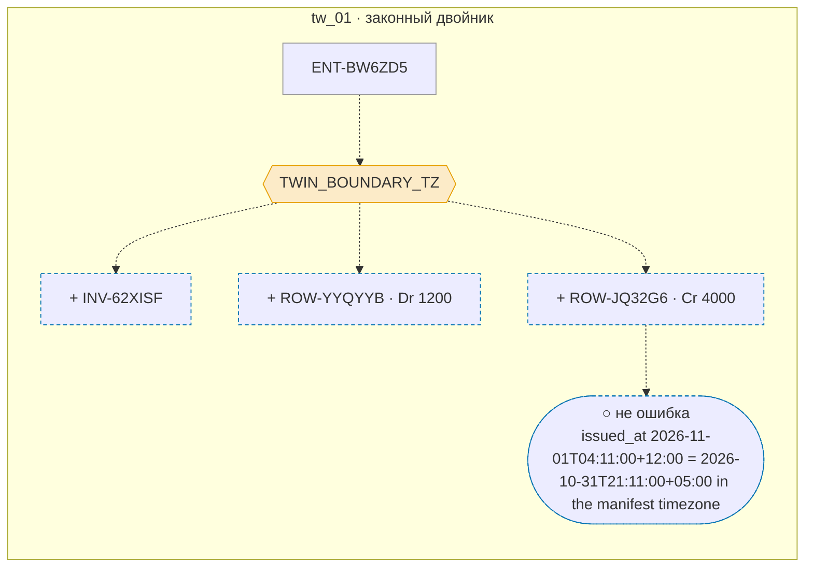
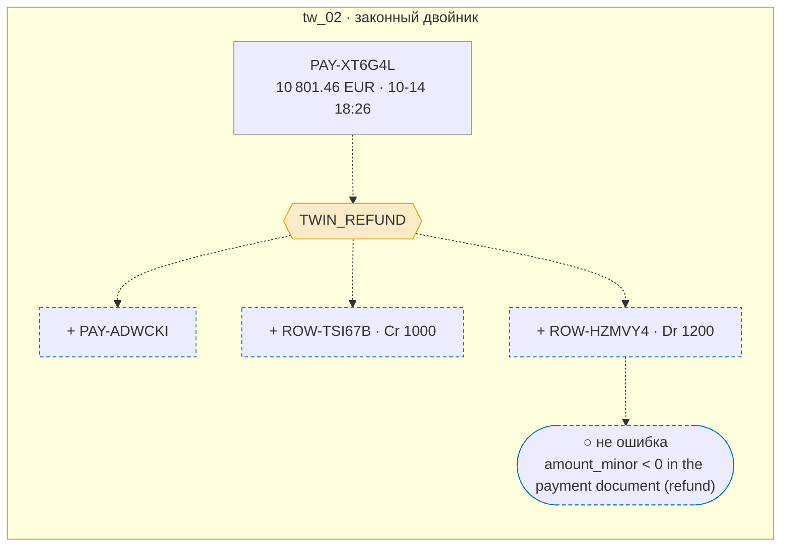
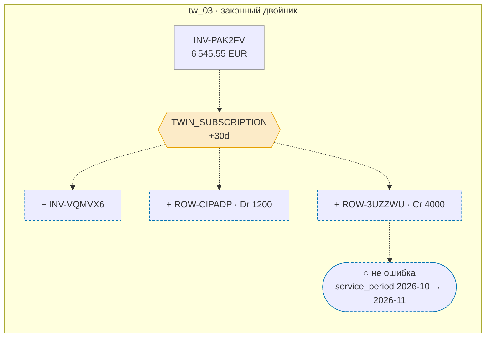

## Граф причинности · эпизод ep_916ae572 · 0 ошибок/групп · 3 двойников

```mermaid
flowchart LR
    classDef clean stroke:#999999
    classDef mut fill:#FCEBC8,stroke:#E69F00
    classDef err fill:#FBE3D6,stroke:#D55E00,stroke-width:2px
    classDef ev fill:#E0F2EC,stroke:#009E73
    classDef truth fill:#F5E3EE,stroke:#CC79A7
    classDef twin stroke:#0072B2,stroke-dasharray:4 3

    subgraph tw_01["tw_01 · законный двойник"]
        tw_01_source_0["ENT-BW6ZD5"]:::clean
        tw_01_mutator_0{{"TWIN_BOUNDARY_TZ<br/>"}}:::mut
        tw_01_diff_0["+ INV-62XISF"]:::twin
        tw_01_diff_1["+ ROW-YYQYYB · Dr 1200"]:::twin
        tw_01_diff_2["+ ROW-JQ32G6 · Cr 4000"]:::twin
        tw_01_truth_0(["○ не ошибка<br/>issued_at 2026-11-01T04:11:00+12:00 = 2026-10-31T21:11:00+05:00 in the manifest timezone"]):::twin
        tw_01_source_0 -.-> tw_01_mutator_0
        tw_01_mutator_0 -.-> tw_01_diff_0
        tw_01_mutator_0 -.-> tw_01_diff_1
        tw_01_mutator_0 -.-> tw_01_diff_2
        tw_01_diff_2 -.-> tw_01_truth_0
    end
```

```mermaid
flowchart LR
    classDef clean stroke:#999999
    classDef mut fill:#FCEBC8,stroke:#E69F00
    classDef err fill:#FBE3D6,stroke:#D55E00,stroke-width:2px
    classDef ev fill:#E0F2EC,stroke:#009E73
    classDef truth fill:#F5E3EE,stroke:#CC79A7
    classDef twin stroke:#0072B2,stroke-dasharray:4 3

    subgraph tw_02["tw_02 · законный двойник"]
        tw_02_source_0["PAY-XT6G4L<br/>10 801.46 EUR · 10-14 18:26"]:::clean
        tw_02_mutator_0{{"TWIN_REFUND<br/>"}}:::mut
        tw_02_diff_0["+ PAY-ADWCKI"]:::twin
        tw_02_diff_1["+ ROW-TSI67B · Cr 1000"]:::twin
        tw_02_diff_2["+ ROW-HZMVY4 · Dr 1200"]:::twin
        tw_02_truth_0(["○ не ошибка<br/>amount_minor #lt; 0 in the payment document (refund)"]):::twin
        tw_02_source_0 -.-> tw_02_mutator_0
        tw_02_mutator_0 -.-> tw_02_diff_0
        tw_02_mutator_0 -.-> tw_02_diff_1
        tw_02_mutator_0 -.-> tw_02_diff_2
        tw_02_diff_2 -.-> tw_02_truth_0
    end
```

```mermaid
flowchart LR
    classDef clean stroke:#999999
    classDef mut fill:#FCEBC8,stroke:#E69F00
    classDef err fill:#FBE3D6,stroke:#D55E00,stroke-width:2px
    classDef ev fill:#E0F2EC,stroke:#009E73
    classDef truth fill:#F5E3EE,stroke:#CC79A7
    classDef twin stroke:#0072B2,stroke-dasharray:4 3

    subgraph tw_03["tw_03 · законный двойник"]
        tw_03_source_0["INV-PAK2FV<br/>6 545.55 EUR"]:::clean
        tw_03_mutator_0{{"TWIN_SUBSCRIPTION<br/>+30d"}}:::mut
        tw_03_diff_0["+ INV-VQMVX6"]:::twin
        tw_03_diff_1["+ ROW-CIPADP · Dr 1200"]:::twin
        tw_03_diff_2["+ ROW-3UZZWU · Cr 4000"]:::twin
        tw_03_truth_0(["○ не ошибка<br/>service_period 2026-10 → 2026-11"]):::twin
        tw_03_source_0 -.-> tw_03_mutator_0
        tw_03_mutator_0 -.-> tw_03_diff_0
        tw_03_mutator_0 -.-> tw_03_diff_1
        tw_03_mutator_0 -.-> tw_03_diff_2
        tw_03_diff_2 -.-> tw_03_truth_0
    end
```
