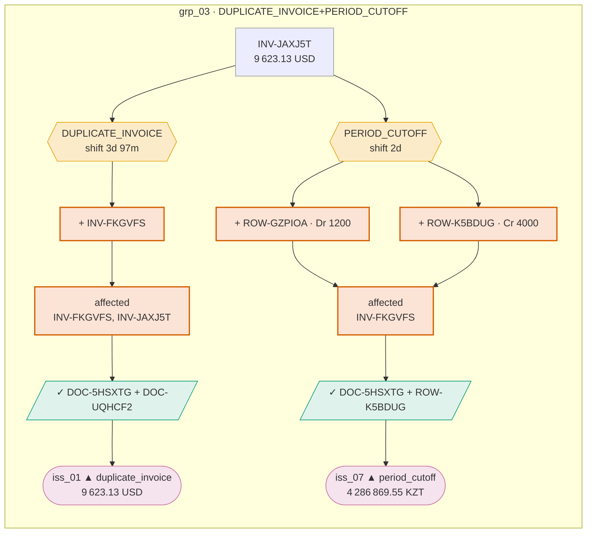
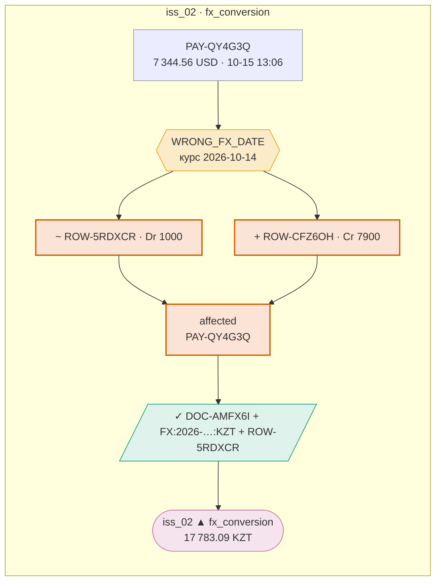
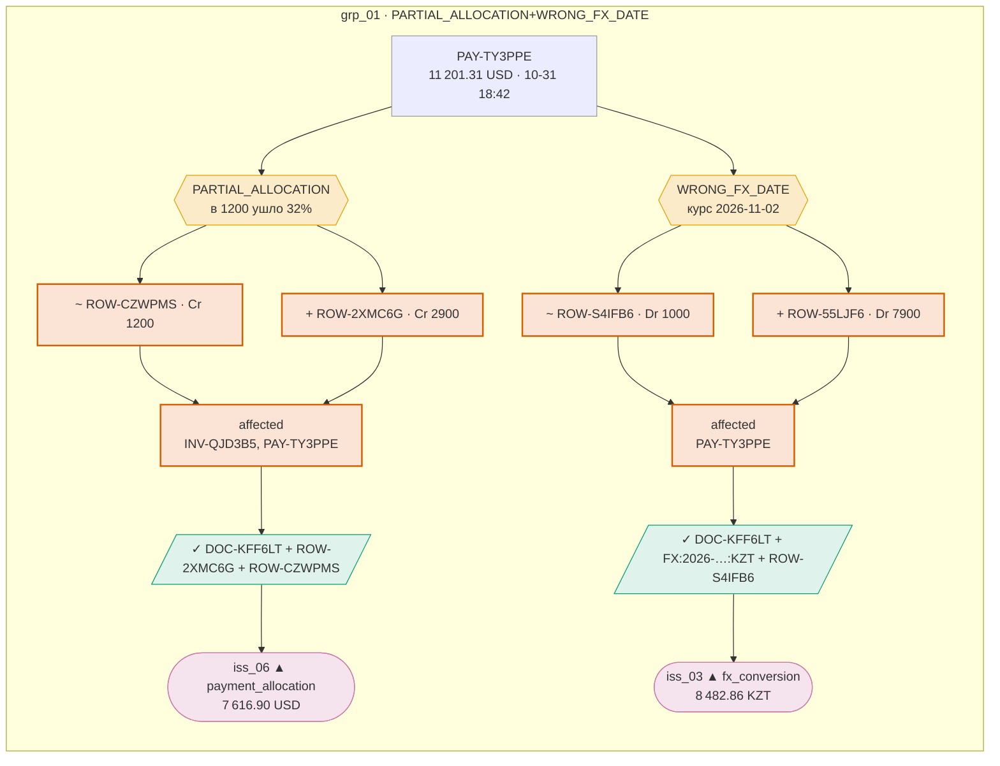
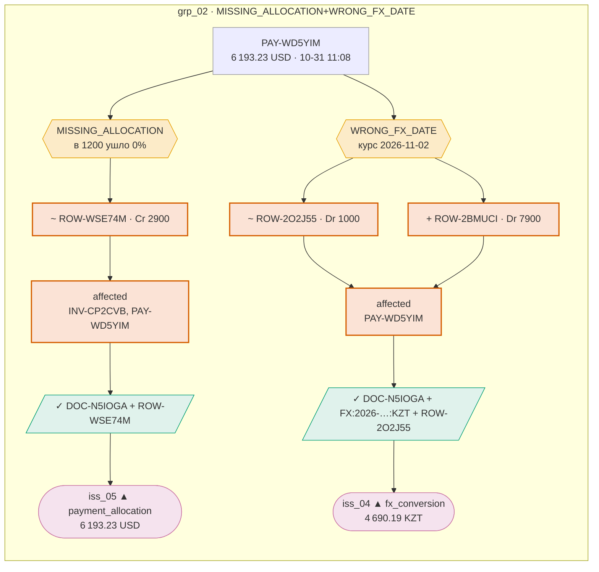
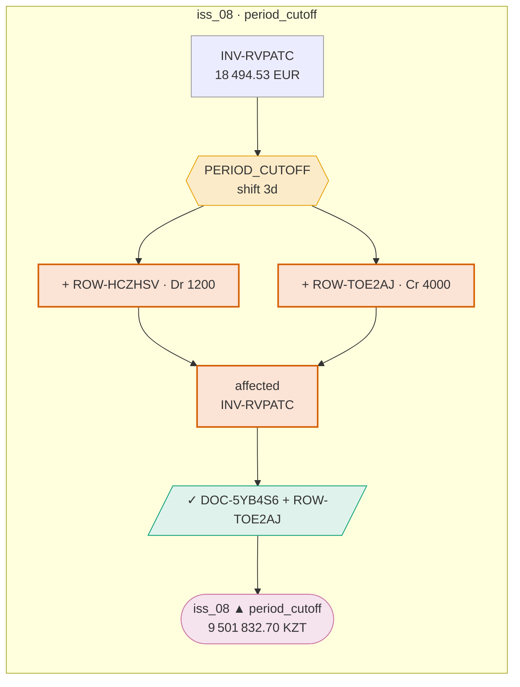
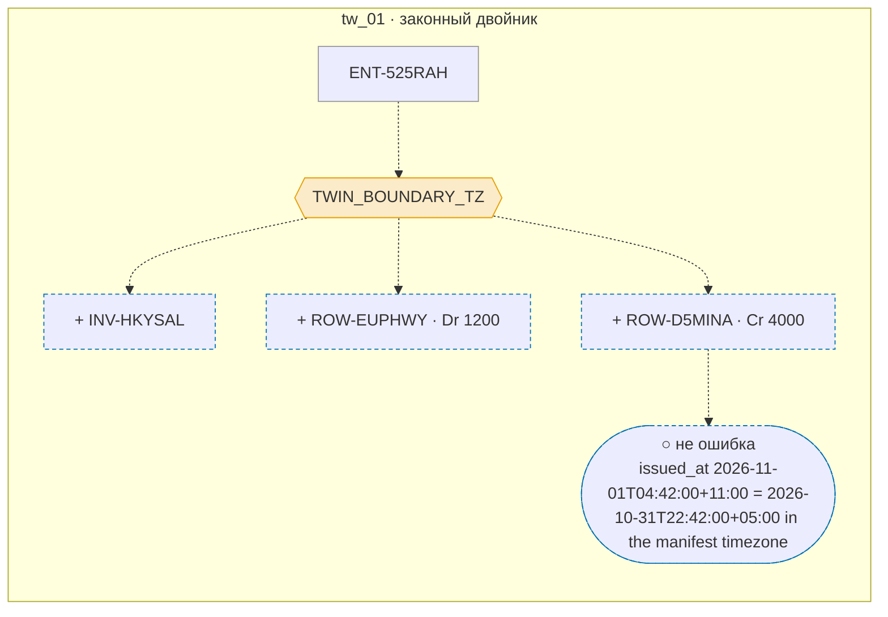
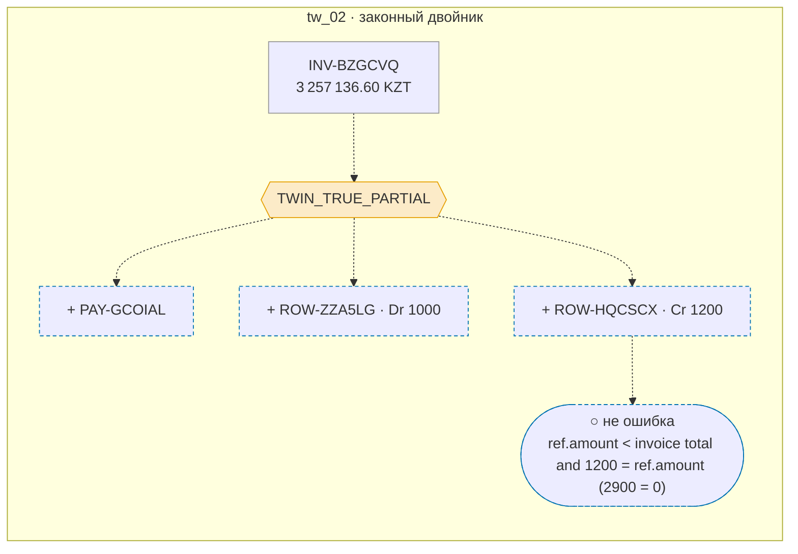

## Граф причинности · эпизод ep_94a6cdc0 · 5 ошибок/групп · 2 двойников

```mermaid
flowchart LR
    classDef clean stroke:#999999
    classDef mut fill:#FCEBC8,stroke:#E69F00
    classDef err fill:#FBE3D6,stroke:#D55E00,stroke-width:2px
    classDef ev fill:#E0F2EC,stroke:#009E73
    classDef truth fill:#F5E3EE,stroke:#CC79A7
    classDef twin stroke:#0072B2,stroke-dasharray:4 3

    subgraph grp_03["grp_03 · DUPLICATE_INVOICE+PERIOD_CUTOFF"]
        grp_03_source_0["INV-JAXJ5T<br/>9 623.13 USD"]:::clean
        grp_03_mutator_0{{"DUPLICATE_INVOICE<br/>shift 3d 97m"}}:::mut
        grp_03_diff_0["+ INV-FKGVFS"]:::err
        grp_03_affected_0["affected<br/>INV-FKGVFS, INV-JAXJ5T"]:::err
        grp_03_evidence_0[/"✓ DOC-5HSXTG + DOC-UQHCF2"/]:::ev
        grp_03_truth_0(["iss_01 ▲ duplicate_invoice<br/>9 623.13 USD"]):::truth
        grp_03_mutator_1{{"PERIOD_CUTOFF<br/>shift 2d"}}:::mut
        grp_03_diff_1["+ ROW-GZPIOA · Dr 1200"]:::err
        grp_03_diff_2["+ ROW-K5BDUG · Cr 4000"]:::err
        grp_03_affected_1["affected<br/>INV-FKGVFS"]:::err
        grp_03_evidence_1[/"✓ DOC-5HSXTG + ROW-K5BDUG"/]:::ev
        grp_03_truth_1(["iss_07 ▲ period_cutoff<br/>4 286 869.55 KZT"]):::truth
        grp_03_source_0 --> grp_03_mutator_0
        grp_03_mutator_0 --> grp_03_diff_0
        grp_03_diff_0 --> grp_03_affected_0
        grp_03_affected_0 --> grp_03_evidence_0
        grp_03_evidence_0 --> grp_03_truth_0
        grp_03_source_0 --> grp_03_mutator_1
        grp_03_mutator_1 --> grp_03_diff_1
        grp_03_mutator_1 --> grp_03_diff_2
        grp_03_diff_1 --> grp_03_affected_1
        grp_03_diff_2 --> grp_03_affected_1
        grp_03_affected_1 --> grp_03_evidence_1
        grp_03_evidence_1 --> grp_03_truth_1
    end
```

```mermaid
flowchart LR
    classDef clean stroke:#999999
    classDef mut fill:#FCEBC8,stroke:#E69F00
    classDef err fill:#FBE3D6,stroke:#D55E00,stroke-width:2px
    classDef ev fill:#E0F2EC,stroke:#009E73
    classDef truth fill:#F5E3EE,stroke:#CC79A7
    classDef twin stroke:#0072B2,stroke-dasharray:4 3

    subgraph iss_02["iss_02 · fx_conversion"]
        iss_02_source_0["PAY-QY4G3Q<br/>7 344.56 USD · 10-15 13:06"]:::clean
        iss_02_mutator_0{{"WRONG_FX_DATE<br/>курс 2026-10-14"}}:::mut
        iss_02_diff_0["~ ROW-5RDXCR · Dr 1000"]:::err
        iss_02_diff_1["+ ROW-CFZ6OH · Cr 7900"]:::err
        iss_02_affected_0["affected<br/>PAY-QY4G3Q"]:::err
        iss_02_evidence_0[/"✓ DOC-AMFX6I + FX:2026-…:KZT + ROW-5RDXCR"/]:::ev
        iss_02_truth_0(["iss_02 ▲ fx_conversion<br/>17 783.09 KZT"]):::truth
        iss_02_source_0 --> iss_02_mutator_0
        iss_02_mutator_0 --> iss_02_diff_0
        iss_02_mutator_0 --> iss_02_diff_1
        iss_02_diff_0 --> iss_02_affected_0
        iss_02_diff_1 --> iss_02_affected_0
        iss_02_affected_0 --> iss_02_evidence_0
        iss_02_evidence_0 --> iss_02_truth_0
    end
```

```mermaid
flowchart LR
    classDef clean stroke:#999999
    classDef mut fill:#FCEBC8,stroke:#E69F00
    classDef err fill:#FBE3D6,stroke:#D55E00,stroke-width:2px
    classDef ev fill:#E0F2EC,stroke:#009E73
    classDef truth fill:#F5E3EE,stroke:#CC79A7
    classDef twin stroke:#0072B2,stroke-dasharray:4 3

    subgraph grp_01["grp_01 · PARTIAL_ALLOCATION+WRONG_FX_DATE"]
        grp_01_source_0["PAY-TY3PPE<br/>11 201.31 USD · 10-31 18:42"]:::clean
        grp_01_mutator_0{{"PARTIAL_ALLOCATION<br/>в 1200 ушло 32%"}}:::mut
        grp_01_diff_0["~ ROW-CZWPMS · Cr 1200"]:::err
        grp_01_diff_1["+ ROW-2XMC6G · Cr 2900"]:::err
        grp_01_affected_0["affected<br/>INV-QJD3B5, PAY-TY3PPE"]:::err
        grp_01_evidence_0[/"✓ DOC-KFF6LT + ROW-2XMC6G + ROW-CZWPMS"/]:::ev
        grp_01_truth_0(["iss_06 ▲ payment_allocation<br/>7 616.90 USD"]):::truth
        grp_01_mutator_1{{"WRONG_FX_DATE<br/>курс 2026-11-02"}}:::mut
        grp_01_diff_2["~ ROW-S4IFB6 · Dr 1000"]:::err
        grp_01_diff_3["+ ROW-55LJF6 · Dr 7900"]:::err
        grp_01_affected_1["affected<br/>PAY-TY3PPE"]:::err
        grp_01_evidence_1[/"✓ DOC-KFF6LT + FX:2026-…:KZT + ROW-S4IFB6"/]:::ev
        grp_01_truth_1(["iss_03 ▲ fx_conversion<br/>8 482.86 KZT"]):::truth
        grp_01_source_0 --> grp_01_mutator_0
        grp_01_mutator_0 --> grp_01_diff_0
        grp_01_mutator_0 --> grp_01_diff_1
        grp_01_diff_0 --> grp_01_affected_0
        grp_01_diff_1 --> grp_01_affected_0
        grp_01_affected_0 --> grp_01_evidence_0
        grp_01_evidence_0 --> grp_01_truth_0
        grp_01_source_0 --> grp_01_mutator_1
        grp_01_mutator_1 --> grp_01_diff_2
        grp_01_mutator_1 --> grp_01_diff_3
        grp_01_diff_2 --> grp_01_affected_1
        grp_01_diff_3 --> grp_01_affected_1
        grp_01_affected_1 --> grp_01_evidence_1
        grp_01_evidence_1 --> grp_01_truth_1
    end
```

```mermaid
flowchart LR
    classDef clean stroke:#999999
    classDef mut fill:#FCEBC8,stroke:#E69F00
    classDef err fill:#FBE3D6,stroke:#D55E00,stroke-width:2px
    classDef ev fill:#E0F2EC,stroke:#009E73
    classDef truth fill:#F5E3EE,stroke:#CC79A7
    classDef twin stroke:#0072B2,stroke-dasharray:4 3

    subgraph grp_02["grp_02 · MISSING_ALLOCATION+WRONG_FX_DATE"]
        grp_02_source_0["PAY-WD5YIM<br/>6 193.23 USD · 10-31 11:08"]:::clean
        grp_02_mutator_0{{"MISSING_ALLOCATION<br/>в 1200 ушло 0%"}}:::mut
        grp_02_diff_0["~ ROW-WSE74M · Cr 2900"]:::err
        grp_02_affected_0["affected<br/>INV-CP2CVB, PAY-WD5YIM"]:::err
        grp_02_evidence_0[/"✓ DOC-N5IOGA + ROW-WSE74M"/]:::ev
        grp_02_truth_0(["iss_05 ▲ payment_allocation<br/>6 193.23 USD"]):::truth
        grp_02_mutator_1{{"WRONG_FX_DATE<br/>курс 2026-11-02"}}:::mut
        grp_02_diff_1["~ ROW-2O2J55 · Dr 1000"]:::err
        grp_02_diff_2["+ ROW-2BMUCI · Dr 7900"]:::err
        grp_02_affected_1["affected<br/>PAY-WD5YIM"]:::err
        grp_02_evidence_1[/"✓ DOC-N5IOGA + FX:2026-…:KZT + ROW-2O2J55"/]:::ev
        grp_02_truth_1(["iss_04 ▲ fx_conversion<br/>4 690.19 KZT"]):::truth
        grp_02_source_0 --> grp_02_mutator_0
        grp_02_mutator_0 --> grp_02_diff_0
        grp_02_diff_0 --> grp_02_affected_0
        grp_02_affected_0 --> grp_02_evidence_0
        grp_02_evidence_0 --> grp_02_truth_0
        grp_02_source_0 --> grp_02_mutator_1
        grp_02_mutator_1 --> grp_02_diff_1
        grp_02_mutator_1 --> grp_02_diff_2
        grp_02_diff_1 --> grp_02_affected_1
        grp_02_diff_2 --> grp_02_affected_1
        grp_02_affected_1 --> grp_02_evidence_1
        grp_02_evidence_1 --> grp_02_truth_1
    end
```

```mermaid
flowchart LR
    classDef clean stroke:#999999
    classDef mut fill:#FCEBC8,stroke:#E69F00
    classDef err fill:#FBE3D6,stroke:#D55E00,stroke-width:2px
    classDef ev fill:#E0F2EC,stroke:#009E73
    classDef truth fill:#F5E3EE,stroke:#CC79A7
    classDef twin stroke:#0072B2,stroke-dasharray:4 3

    subgraph iss_08["iss_08 · period_cutoff"]
        iss_08_source_0["INV-RVPATC<br/>18 494.53 EUR"]:::clean
        iss_08_mutator_0{{"PERIOD_CUTOFF<br/>shift 3d"}}:::mut
        iss_08_diff_0["+ ROW-HCZHSV · Dr 1200"]:::err
        iss_08_diff_1["+ ROW-TOE2AJ · Cr 4000"]:::err
        iss_08_affected_0["affected<br/>INV-RVPATC"]:::err
        iss_08_evidence_0[/"✓ DOC-5YB4S6 + ROW-TOE2AJ"/]:::ev
        iss_08_truth_0(["iss_08 ▲ period_cutoff<br/>9 501 832.70 KZT"]):::truth
        iss_08_source_0 --> iss_08_mutator_0
        iss_08_mutator_0 --> iss_08_diff_0
        iss_08_mutator_0 --> iss_08_diff_1
        iss_08_diff_0 --> iss_08_affected_0
        iss_08_diff_1 --> iss_08_affected_0
        iss_08_affected_0 --> iss_08_evidence_0
        iss_08_evidence_0 --> iss_08_truth_0
    end
```

```mermaid
flowchart LR
    classDef clean stroke:#999999
    classDef mut fill:#FCEBC8,stroke:#E69F00
    classDef err fill:#FBE3D6,stroke:#D55E00,stroke-width:2px
    classDef ev fill:#E0F2EC,stroke:#009E73
    classDef truth fill:#F5E3EE,stroke:#CC79A7
    classDef twin stroke:#0072B2,stroke-dasharray:4 3

    subgraph tw_01["tw_01 · законный двойник"]
        tw_01_source_0["ENT-525RAH"]:::clean
        tw_01_mutator_0{{"TWIN_BOUNDARY_TZ<br/>"}}:::mut
        tw_01_diff_0["+ INV-HKYSAL"]:::twin
        tw_01_diff_1["+ ROW-EUPHWY · Dr 1200"]:::twin
        tw_01_diff_2["+ ROW-D5MINA · Cr 4000"]:::twin
        tw_01_truth_0(["○ не ошибка<br/>issued_at 2026-11-01T04:42:00+11:00 = 2026-10-31T22:42:00+05:00 in the manifest timezone"]):::twin
        tw_01_source_0 -.-> tw_01_mutator_0
        tw_01_mutator_0 -.-> tw_01_diff_0
        tw_01_mutator_0 -.-> tw_01_diff_1
        tw_01_mutator_0 -.-> tw_01_diff_2
        tw_01_diff_2 -.-> tw_01_truth_0
    end
```

```mermaid
flowchart LR
    classDef clean stroke:#999999
    classDef mut fill:#FCEBC8,stroke:#E69F00
    classDef err fill:#FBE3D6,stroke:#D55E00,stroke-width:2px
    classDef ev fill:#E0F2EC,stroke:#009E73
    classDef truth fill:#F5E3EE,stroke:#CC79A7
    classDef twin stroke:#0072B2,stroke-dasharray:4 3

    subgraph tw_02["tw_02 · законный двойник"]
        tw_02_source_0["INV-BZGCVQ<br/>3 257 136.60 KZT"]:::clean
        tw_02_mutator_0{{"TWIN_TRUE_PARTIAL<br/>"}}:::mut
        tw_02_diff_0["+ PAY-GCOIAL"]:::twin
        tw_02_diff_1["+ ROW-ZZA5LG · Dr 1000"]:::twin
        tw_02_diff_2["+ ROW-HQCSCX · Cr 1200"]:::twin
        tw_02_truth_0(["○ не ошибка<br/>ref.amount #lt; invoice total and 1200 = ref.amount (2900 = 0)"]):::twin
        tw_02_source_0 -.-> tw_02_mutator_0
        tw_02_mutator_0 -.-> tw_02_diff_0
        tw_02_mutator_0 -.-> tw_02_diff_1
        tw_02_mutator_0 -.-> tw_02_diff_2
        tw_02_diff_2 -.-> tw_02_truth_0
    end
```
