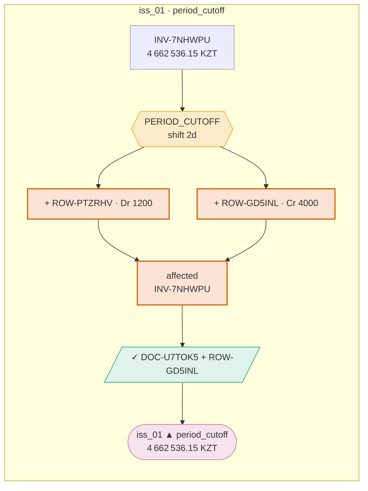
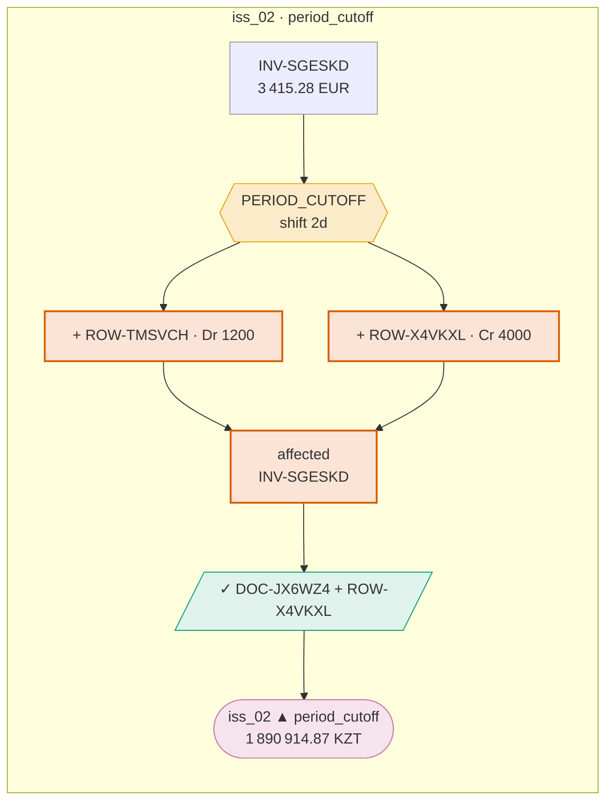
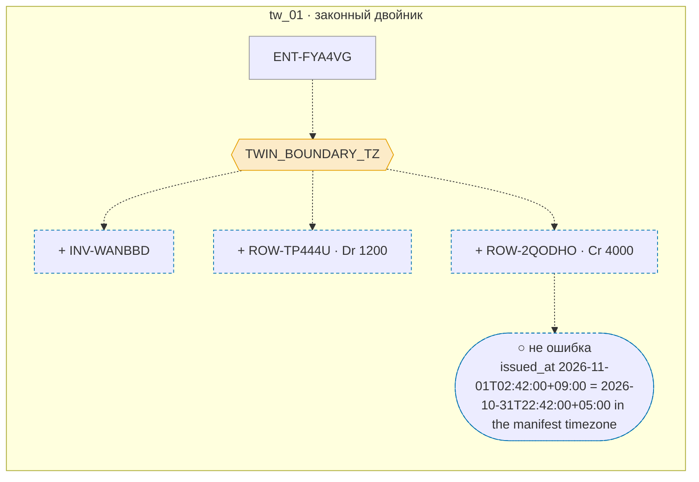
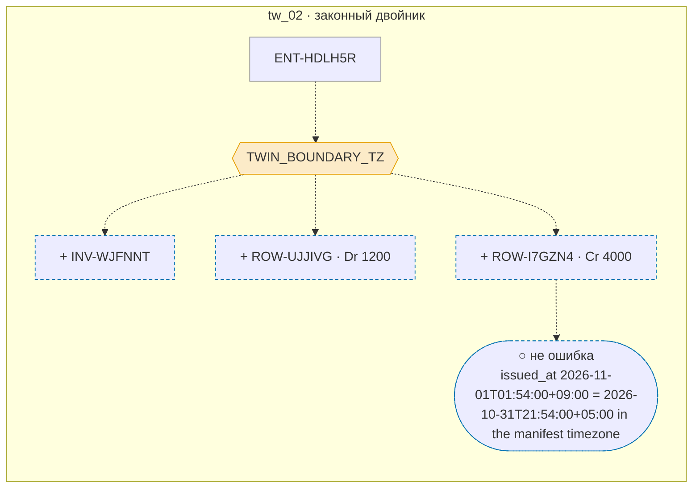

## Граф причинности · эпизод ep_9876c9b0 · 2 ошибок/групп · 2 двойников

```mermaid
flowchart LR
    classDef clean stroke:#999999
    classDef mut fill:#FCEBC8,stroke:#E69F00
    classDef err fill:#FBE3D6,stroke:#D55E00,stroke-width:2px
    classDef ev fill:#E0F2EC,stroke:#009E73
    classDef truth fill:#F5E3EE,stroke:#CC79A7
    classDef twin stroke:#0072B2,stroke-dasharray:4 3

    subgraph iss_01["iss_01 · period_cutoff"]
        iss_01_source_0["INV-7NHWPU<br/>4 662 536.15 KZT"]:::clean
        iss_01_mutator_0{{"PERIOD_CUTOFF<br/>shift 2d"}}:::mut
        iss_01_diff_0["+ ROW-PTZRHV · Dr 1200"]:::err
        iss_01_diff_1["+ ROW-GD5INL · Cr 4000"]:::err
        iss_01_affected_0["affected<br/>INV-7NHWPU"]:::err
        iss_01_evidence_0[/"✓ DOC-U7TOK5 + ROW-GD5INL"/]:::ev
        iss_01_truth_0(["iss_01 ▲ period_cutoff<br/>4 662 536.15 KZT"]):::truth
        iss_01_source_0 --> iss_01_mutator_0
        iss_01_mutator_0 --> iss_01_diff_0
        iss_01_mutator_0 --> iss_01_diff_1
        iss_01_diff_0 --> iss_01_affected_0
        iss_01_diff_1 --> iss_01_affected_0
        iss_01_affected_0 --> iss_01_evidence_0
        iss_01_evidence_0 --> iss_01_truth_0
    end
```

```mermaid
flowchart LR
    classDef clean stroke:#999999
    classDef mut fill:#FCEBC8,stroke:#E69F00
    classDef err fill:#FBE3D6,stroke:#D55E00,stroke-width:2px
    classDef ev fill:#E0F2EC,stroke:#009E73
    classDef truth fill:#F5E3EE,stroke:#CC79A7
    classDef twin stroke:#0072B2,stroke-dasharray:4 3

    subgraph iss_02["iss_02 · period_cutoff"]
        iss_02_source_0["INV-SGESKD<br/>3 415.28 EUR"]:::clean
        iss_02_mutator_0{{"PERIOD_CUTOFF<br/>shift 2d"}}:::mut
        iss_02_diff_0["+ ROW-TMSVCH · Dr 1200"]:::err
        iss_02_diff_1["+ ROW-X4VKXL · Cr 4000"]:::err
        iss_02_affected_0["affected<br/>INV-SGESKD"]:::err
        iss_02_evidence_0[/"✓ DOC-JX6WZ4 + ROW-X4VKXL"/]:::ev
        iss_02_truth_0(["iss_02 ▲ period_cutoff<br/>1 890 914.87 KZT"]):::truth
        iss_02_source_0 --> iss_02_mutator_0
        iss_02_mutator_0 --> iss_02_diff_0
        iss_02_mutator_0 --> iss_02_diff_1
        iss_02_diff_0 --> iss_02_affected_0
        iss_02_diff_1 --> iss_02_affected_0
        iss_02_affected_0 --> iss_02_evidence_0
        iss_02_evidence_0 --> iss_02_truth_0
    end
```

```mermaid
flowchart LR
    classDef clean stroke:#999999
    classDef mut fill:#FCEBC8,stroke:#E69F00
    classDef err fill:#FBE3D6,stroke:#D55E00,stroke-width:2px
    classDef ev fill:#E0F2EC,stroke:#009E73
    classDef truth fill:#F5E3EE,stroke:#CC79A7
    classDef twin stroke:#0072B2,stroke-dasharray:4 3

    subgraph tw_01["tw_01 · законный двойник"]
        tw_01_source_0["ENT-FYA4VG"]:::clean
        tw_01_mutator_0{{"TWIN_BOUNDARY_TZ<br/>"}}:::mut
        tw_01_diff_0["+ INV-WANBBD"]:::twin
        tw_01_diff_1["+ ROW-TP444U · Dr 1200"]:::twin
        tw_01_diff_2["+ ROW-2QODHO · Cr 4000"]:::twin
        tw_01_truth_0(["○ не ошибка<br/>issued_at 2026-11-01T02:42:00+09:00 = 2026-10-31T22:42:00+05:00 in the manifest timezone"]):::twin
        tw_01_source_0 -.-> tw_01_mutator_0
        tw_01_mutator_0 -.-> tw_01_diff_0
        tw_01_mutator_0 -.-> tw_01_diff_1
        tw_01_mutator_0 -.-> tw_01_diff_2
        tw_01_diff_2 -.-> tw_01_truth_0
    end
```

```mermaid
flowchart LR
    classDef clean stroke:#999999
    classDef mut fill:#FCEBC8,stroke:#E69F00
    classDef err fill:#FBE3D6,stroke:#D55E00,stroke-width:2px
    classDef ev fill:#E0F2EC,stroke:#009E73
    classDef truth fill:#F5E3EE,stroke:#CC79A7
    classDef twin stroke:#0072B2,stroke-dasharray:4 3

    subgraph tw_02["tw_02 · законный двойник"]
        tw_02_source_0["ENT-HDLH5R"]:::clean
        tw_02_mutator_0{{"TWIN_BOUNDARY_TZ<br/>"}}:::mut
        tw_02_diff_0["+ INV-WJFNNT"]:::twin
        tw_02_diff_1["+ ROW-UJJIVG · Dr 1200"]:::twin
        tw_02_diff_2["+ ROW-I7GZN4 · Cr 4000"]:::twin
        tw_02_truth_0(["○ не ошибка<br/>issued_at 2026-11-01T01:54:00+09:00 = 2026-10-31T21:54:00+05:00 in the manifest timezone"]):::twin
        tw_02_source_0 -.-> tw_02_mutator_0
        tw_02_mutator_0 -.-> tw_02_diff_0
        tw_02_mutator_0 -.-> tw_02_diff_1
        tw_02_mutator_0 -.-> tw_02_diff_2
        tw_02_diff_2 -.-> tw_02_truth_0
    end
```
