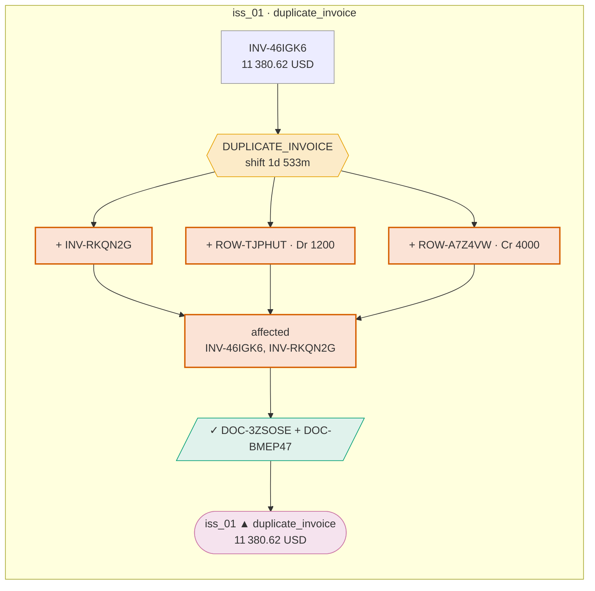
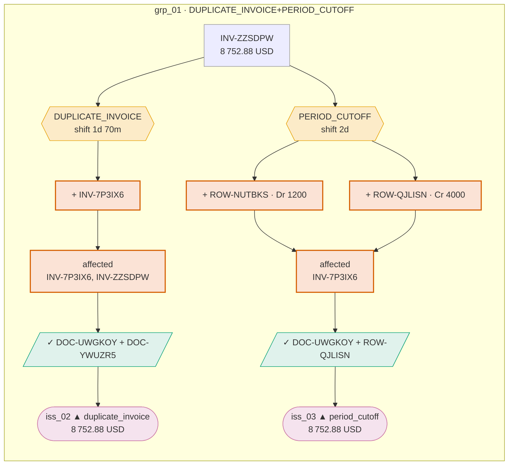
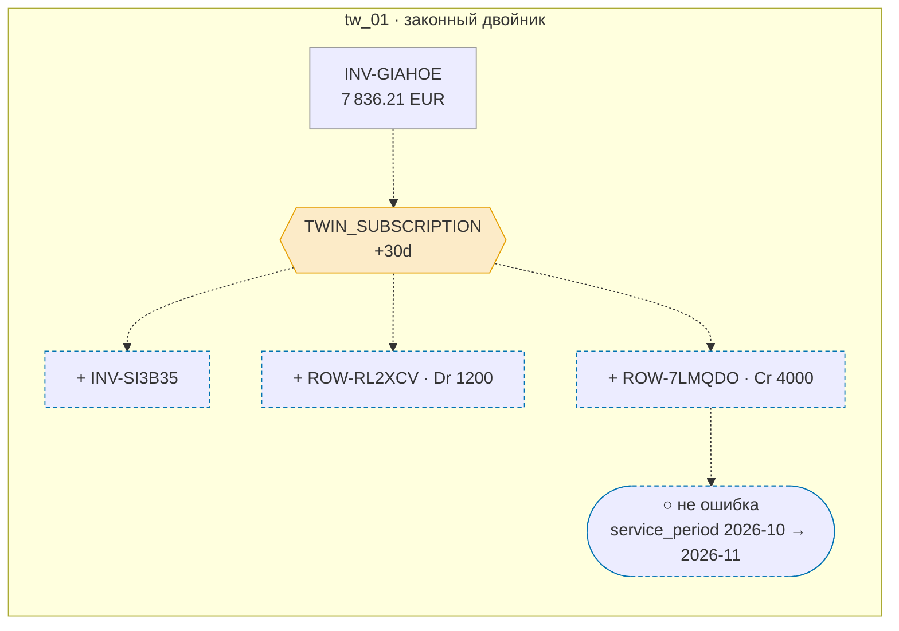

## Граф причинности · эпизод ep_9d34a39c · 2 ошибок/групп · 1 двойников

```mermaid
flowchart LR
    classDef clean stroke:#999999
    classDef mut fill:#FCEBC8,stroke:#E69F00
    classDef err fill:#FBE3D6,stroke:#D55E00,stroke-width:2px
    classDef ev fill:#E0F2EC,stroke:#009E73
    classDef truth fill:#F5E3EE,stroke:#CC79A7
    classDef twin stroke:#0072B2,stroke-dasharray:4 3

    subgraph iss_01["iss_01 · duplicate_invoice"]
        iss_01_source_0["INV-46IGK6<br/>11 380.62 USD"]:::clean
        iss_01_mutator_0{{"DUPLICATE_INVOICE<br/>shift 1d 533m"}}:::mut
        iss_01_diff_0["+ INV-RKQN2G"]:::err
        iss_01_diff_1["+ ROW-TJPHUT · Dr 1200"]:::err
        iss_01_diff_2["+ ROW-A7Z4VW · Cr 4000"]:::err
        iss_01_affected_0["affected<br/>INV-46IGK6, INV-RKQN2G"]:::err
        iss_01_evidence_0[/"✓ DOC-3ZSOSE + DOC-BMEP47"/]:::ev
        iss_01_truth_0(["iss_01 ▲ duplicate_invoice<br/>11 380.62 USD"]):::truth
        iss_01_source_0 --> iss_01_mutator_0
        iss_01_mutator_0 --> iss_01_diff_0
        iss_01_mutator_0 --> iss_01_diff_1
        iss_01_mutator_0 --> iss_01_diff_2
        iss_01_diff_0 --> iss_01_affected_0
        iss_01_diff_1 --> iss_01_affected_0
        iss_01_diff_2 --> iss_01_affected_0
        iss_01_affected_0 --> iss_01_evidence_0
        iss_01_evidence_0 --> iss_01_truth_0
    end
```

```mermaid
flowchart LR
    classDef clean stroke:#999999
    classDef mut fill:#FCEBC8,stroke:#E69F00
    classDef err fill:#FBE3D6,stroke:#D55E00,stroke-width:2px
    classDef ev fill:#E0F2EC,stroke:#009E73
    classDef truth fill:#F5E3EE,stroke:#CC79A7
    classDef twin stroke:#0072B2,stroke-dasharray:4 3

    subgraph grp_01["grp_01 · DUPLICATE_INVOICE+PERIOD_CUTOFF"]
        grp_01_source_0["INV-ZZSDPW<br/>8 752.88 USD"]:::clean
        grp_01_mutator_0{{"DUPLICATE_INVOICE<br/>shift 1d 70m"}}:::mut
        grp_01_diff_0["+ INV-7P3IX6"]:::err
        grp_01_affected_0["affected<br/>INV-7P3IX6, INV-ZZSDPW"]:::err
        grp_01_evidence_0[/"✓ DOC-UWGKOY + DOC-YWUZR5"/]:::ev
        grp_01_truth_0(["iss_02 ▲ duplicate_invoice<br/>8 752.88 USD"]):::truth
        grp_01_mutator_1{{"PERIOD_CUTOFF<br/>shift 2d"}}:::mut
        grp_01_diff_1["+ ROW-NUTBKS · Dr 1200"]:::err
        grp_01_diff_2["+ ROW-QJLISN · Cr 4000"]:::err
        grp_01_affected_1["affected<br/>INV-7P3IX6"]:::err
        grp_01_evidence_1[/"✓ DOC-UWGKOY + ROW-QJLISN"/]:::ev
        grp_01_truth_1(["iss_03 ▲ period_cutoff<br/>8 752.88 USD"]):::truth
        grp_01_source_0 --> grp_01_mutator_0
        grp_01_mutator_0 --> grp_01_diff_0
        grp_01_diff_0 --> grp_01_affected_0
        grp_01_affected_0 --> grp_01_evidence_0
        grp_01_evidence_0 --> grp_01_truth_0
        grp_01_source_0 --> grp_01_mutator_1
        grp_01_mutator_1 --> grp_01_diff_1
        grp_01_mutator_1 --> grp_01_diff_2
        grp_01_diff_1 --> grp_01_affected_1
        grp_01_diff_2 --> grp_01_affected_1
        grp_01_affected_1 --> grp_01_evidence_1
        grp_01_evidence_1 --> grp_01_truth_1
    end
```

```mermaid
flowchart LR
    classDef clean stroke:#999999
    classDef mut fill:#FCEBC8,stroke:#E69F00
    classDef err fill:#FBE3D6,stroke:#D55E00,stroke-width:2px
    classDef ev fill:#E0F2EC,stroke:#009E73
    classDef truth fill:#F5E3EE,stroke:#CC79A7
    classDef twin stroke:#0072B2,stroke-dasharray:4 3

    subgraph tw_01["tw_01 · законный двойник"]
        tw_01_source_0["INV-GIAHOE<br/>7 836.21 EUR"]:::clean
        tw_01_mutator_0{{"TWIN_SUBSCRIPTION<br/>+30d"}}:::mut
        tw_01_diff_0["+ INV-SI3B35"]:::twin
        tw_01_diff_1["+ ROW-RL2XCV · Dr 1200"]:::twin
        tw_01_diff_2["+ ROW-7LMQDO · Cr 4000"]:::twin
        tw_01_truth_0(["○ не ошибка<br/>service_period 2026-10 → 2026-11"]):::twin
        tw_01_source_0 -.-> tw_01_mutator_0
        tw_01_mutator_0 -.-> tw_01_diff_0
        tw_01_mutator_0 -.-> tw_01_diff_1
        tw_01_mutator_0 -.-> tw_01_diff_2
        tw_01_diff_2 -.-> tw_01_truth_0
    end
```
