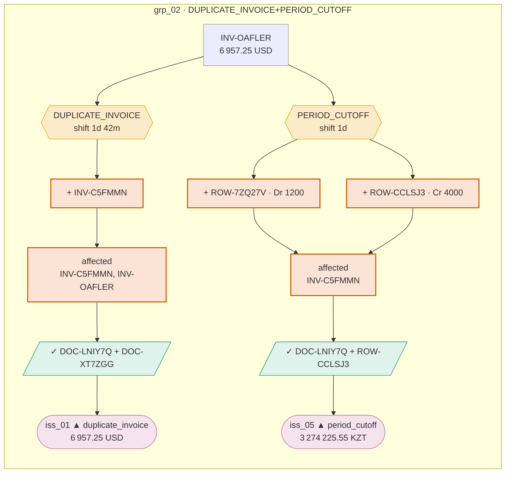
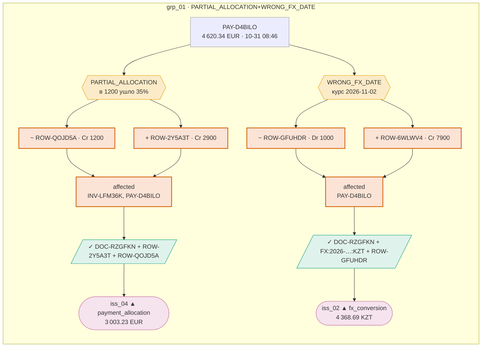
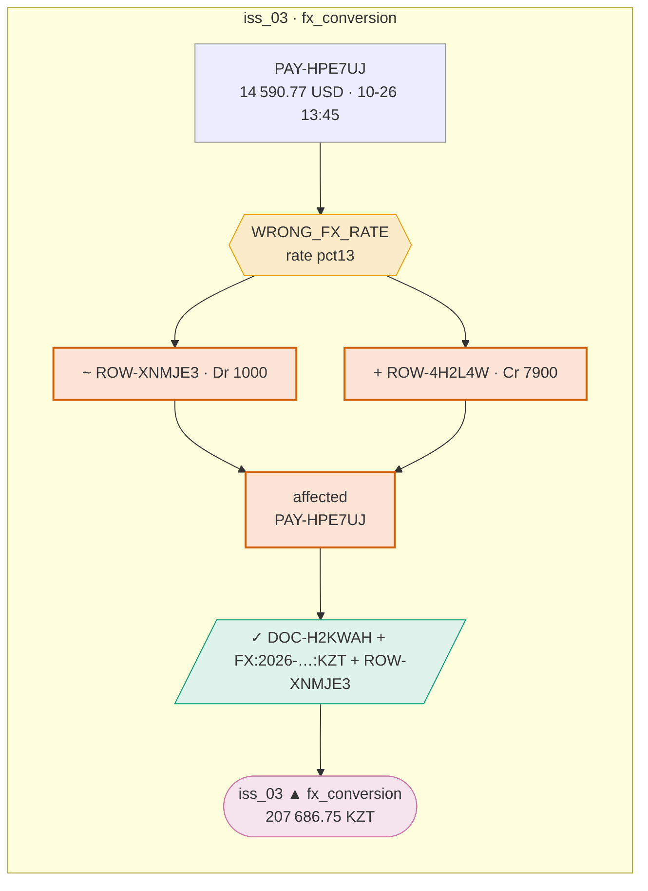
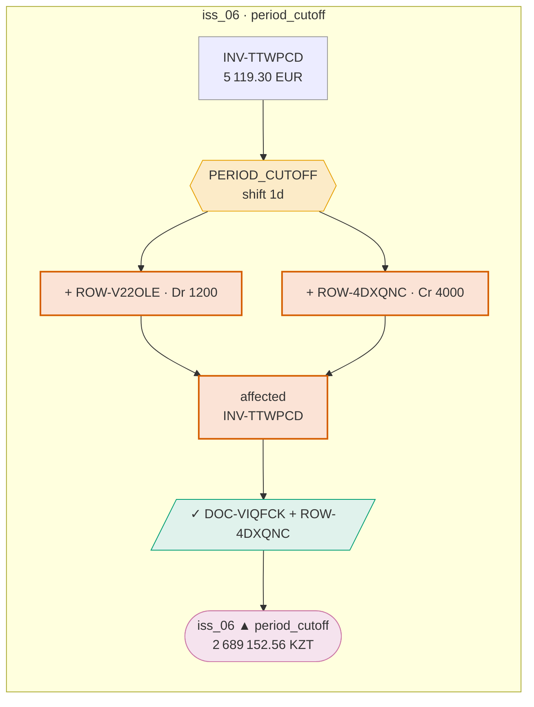
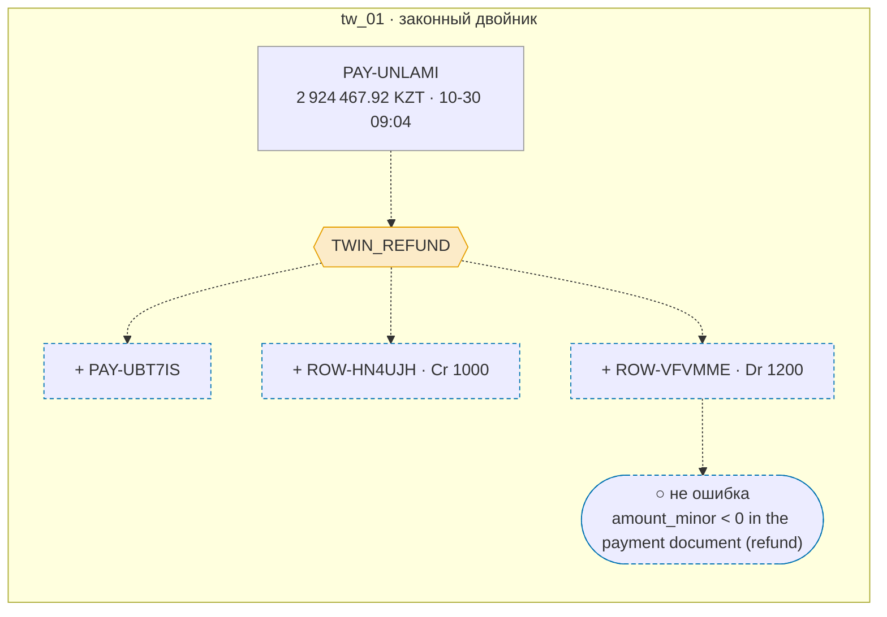
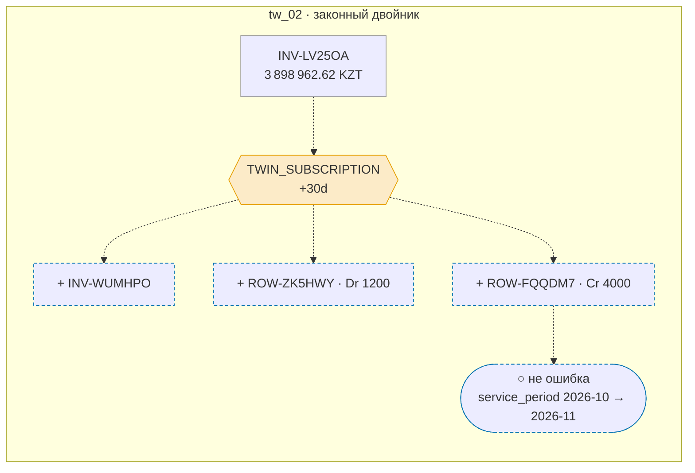

## Граф причинности · эпизод ep_b3369a08 · 4 ошибок/групп · 2 двойников

```mermaid
flowchart LR
    classDef clean stroke:#999999
    classDef mut fill:#FCEBC8,stroke:#E69F00
    classDef err fill:#FBE3D6,stroke:#D55E00,stroke-width:2px
    classDef ev fill:#E0F2EC,stroke:#009E73
    classDef truth fill:#F5E3EE,stroke:#CC79A7
    classDef twin stroke:#0072B2,stroke-dasharray:4 3

    subgraph grp_02["grp_02 · DUPLICATE_INVOICE+PERIOD_CUTOFF"]
        grp_02_source_0["INV-OAFLER<br/>6 957.25 USD"]:::clean
        grp_02_mutator_0{{"DUPLICATE_INVOICE<br/>shift 1d 42m"}}:::mut
        grp_02_diff_0["+ INV-C5FMMN"]:::err
        grp_02_affected_0["affected<br/>INV-C5FMMN, INV-OAFLER"]:::err
        grp_02_evidence_0[/"✓ DOC-LNIY7Q + DOC-XT7ZGG"/]:::ev
        grp_02_truth_0(["iss_01 ▲ duplicate_invoice<br/>6 957.25 USD"]):::truth
        grp_02_mutator_1{{"PERIOD_CUTOFF<br/>shift 1d"}}:::mut
        grp_02_diff_1["+ ROW-7ZQ27V · Dr 1200"]:::err
        grp_02_diff_2["+ ROW-CCLSJ3 · Cr 4000"]:::err
        grp_02_affected_1["affected<br/>INV-C5FMMN"]:::err
        grp_02_evidence_1[/"✓ DOC-LNIY7Q + ROW-CCLSJ3"/]:::ev
        grp_02_truth_1(["iss_05 ▲ period_cutoff<br/>3 274 225.55 KZT"]):::truth
        grp_02_source_0 --> grp_02_mutator_0
        grp_02_mutator_0 --> grp_02_diff_0
        grp_02_diff_0 --> grp_02_affected_0
        grp_02_affected_0 --> grp_02_evidence_0
        grp_02_evidence_0 --> grp_02_truth_0
        grp_02_source_0 --> grp_02_mutator_1
        grp_02_mutator_1 --> grp_02_diff_1
        grp_02_mutator_1 --> grp_02_diff_2
        grp_02_diff_1 --> grp_02_affected_1
        grp_02_diff_2 --> grp_02_affected_1
        grp_02_affected_1 --> grp_02_evidence_1
        grp_02_evidence_1 --> grp_02_truth_1
    end
```

```mermaid
flowchart LR
    classDef clean stroke:#999999
    classDef mut fill:#FCEBC8,stroke:#E69F00
    classDef err fill:#FBE3D6,stroke:#D55E00,stroke-width:2px
    classDef ev fill:#E0F2EC,stroke:#009E73
    classDef truth fill:#F5E3EE,stroke:#CC79A7
    classDef twin stroke:#0072B2,stroke-dasharray:4 3

    subgraph grp_01["grp_01 · PARTIAL_ALLOCATION+WRONG_FX_DATE"]
        grp_01_source_0["PAY-D4BILO<br/>4 620.34 EUR · 10-31 08:46"]:::clean
        grp_01_mutator_0{{"PARTIAL_ALLOCATION<br/>в 1200 ушло 35%"}}:::mut
        grp_01_diff_0["~ ROW-QOJD5A · Cr 1200"]:::err
        grp_01_diff_1["+ ROW-2Y5A3T · Cr 2900"]:::err
        grp_01_affected_0["affected<br/>INV-LFM36K, PAY-D4BILO"]:::err
        grp_01_evidence_0[/"✓ DOC-RZGFKN + ROW-2Y5A3T + ROW-QOJD5A"/]:::ev
        grp_01_truth_0(["iss_04 ▲ payment_allocation<br/>3 003.23 EUR"]):::truth
        grp_01_mutator_1{{"WRONG_FX_DATE<br/>курс 2026-11-02"}}:::mut
        grp_01_diff_2["~ ROW-GFUHDR · Dr 1000"]:::err
        grp_01_diff_3["+ ROW-6WLWV4 · Cr 7900"]:::err
        grp_01_affected_1["affected<br/>PAY-D4BILO"]:::err
        grp_01_evidence_1[/"✓ DOC-RZGFKN + FX:2026-…:KZT + ROW-GFUHDR"/]:::ev
        grp_01_truth_1(["iss_02 ▲ fx_conversion<br/>4 368.69 KZT"]):::truth
        grp_01_source_0 --> grp_01_mutator_0
        grp_01_mutator_0 --> grp_01_diff_0
        grp_01_mutator_0 --> grp_01_diff_1
        grp_01_diff_0 --> grp_01_affected_0
        grp_01_diff_1 --> grp_01_affected_0
        grp_01_affected_0 --> grp_01_evidence_0
        grp_01_evidence_0 --> grp_01_truth_0
        grp_01_source_0 --> grp_01_mutator_1
        grp_01_mutator_1 --> grp_01_diff_2
        grp_01_mutator_1 --> grp_01_diff_3
        grp_01_diff_2 --> grp_01_affected_1
        grp_01_diff_3 --> grp_01_affected_1
        grp_01_affected_1 --> grp_01_evidence_1
        grp_01_evidence_1 --> grp_01_truth_1
    end
```

```mermaid
flowchart LR
    classDef clean stroke:#999999
    classDef mut fill:#FCEBC8,stroke:#E69F00
    classDef err fill:#FBE3D6,stroke:#D55E00,stroke-width:2px
    classDef ev fill:#E0F2EC,stroke:#009E73
    classDef truth fill:#F5E3EE,stroke:#CC79A7
    classDef twin stroke:#0072B2,stroke-dasharray:4 3

    subgraph iss_03["iss_03 · fx_conversion"]
        iss_03_source_0["PAY-HPE7UJ<br/>14 590.77 USD · 10-26 13:45"]:::clean
        iss_03_mutator_0{{"WRONG_FX_RATE<br/>rate pct13"}}:::mut
        iss_03_diff_0["~ ROW-XNMJE3 · Dr 1000"]:::err
        iss_03_diff_1["+ ROW-4H2L4W · Cr 7900"]:::err
        iss_03_affected_0["affected<br/>PAY-HPE7UJ"]:::err
        iss_03_evidence_0[/"✓ DOC-H2KWAH + FX:2026-…:KZT + ROW-XNMJE3"/]:::ev
        iss_03_truth_0(["iss_03 ▲ fx_conversion<br/>207 686.75 KZT"]):::truth
        iss_03_source_0 --> iss_03_mutator_0
        iss_03_mutator_0 --> iss_03_diff_0
        iss_03_mutator_0 --> iss_03_diff_1
        iss_03_diff_0 --> iss_03_affected_0
        iss_03_diff_1 --> iss_03_affected_0
        iss_03_affected_0 --> iss_03_evidence_0
        iss_03_evidence_0 --> iss_03_truth_0
    end
```

```mermaid
flowchart LR
    classDef clean stroke:#999999
    classDef mut fill:#FCEBC8,stroke:#E69F00
    classDef err fill:#FBE3D6,stroke:#D55E00,stroke-width:2px
    classDef ev fill:#E0F2EC,stroke:#009E73
    classDef truth fill:#F5E3EE,stroke:#CC79A7
    classDef twin stroke:#0072B2,stroke-dasharray:4 3

    subgraph iss_06["iss_06 · period_cutoff"]
        iss_06_source_0["INV-TTWPCD<br/>5 119.30 EUR"]:::clean
        iss_06_mutator_0{{"PERIOD_CUTOFF<br/>shift 1d"}}:::mut
        iss_06_diff_0["+ ROW-V22OLE · Dr 1200"]:::err
        iss_06_diff_1["+ ROW-4DXQNC · Cr 4000"]:::err
        iss_06_affected_0["affected<br/>INV-TTWPCD"]:::err
        iss_06_evidence_0[/"✓ DOC-VIQFCK + ROW-4DXQNC"/]:::ev
        iss_06_truth_0(["iss_06 ▲ period_cutoff<br/>2 689 152.56 KZT"]):::truth
        iss_06_source_0 --> iss_06_mutator_0
        iss_06_mutator_0 --> iss_06_diff_0
        iss_06_mutator_0 --> iss_06_diff_1
        iss_06_diff_0 --> iss_06_affected_0
        iss_06_diff_1 --> iss_06_affected_0
        iss_06_affected_0 --> iss_06_evidence_0
        iss_06_evidence_0 --> iss_06_truth_0
    end
```

```mermaid
flowchart LR
    classDef clean stroke:#999999
    classDef mut fill:#FCEBC8,stroke:#E69F00
    classDef err fill:#FBE3D6,stroke:#D55E00,stroke-width:2px
    classDef ev fill:#E0F2EC,stroke:#009E73
    classDef truth fill:#F5E3EE,stroke:#CC79A7
    classDef twin stroke:#0072B2,stroke-dasharray:4 3

    subgraph tw_01["tw_01 · законный двойник"]
        tw_01_source_0["PAY-UNLAMI<br/>2 924 467.92 KZT · 10-30 09:04"]:::clean
        tw_01_mutator_0{{"TWIN_REFUND<br/>"}}:::mut
        tw_01_diff_0["+ PAY-UBT7IS"]:::twin
        tw_01_diff_1["+ ROW-HN4UJH · Cr 1000"]:::twin
        tw_01_diff_2["+ ROW-VFVMME · Dr 1200"]:::twin
        tw_01_truth_0(["○ не ошибка<br/>amount_minor #lt; 0 in the payment document (refund)"]):::twin
        tw_01_source_0 -.-> tw_01_mutator_0
        tw_01_mutator_0 -.-> tw_01_diff_0
        tw_01_mutator_0 -.-> tw_01_diff_1
        tw_01_mutator_0 -.-> tw_01_diff_2
        tw_01_diff_2 -.-> tw_01_truth_0
    end
```

```mermaid
flowchart LR
    classDef clean stroke:#999999
    classDef mut fill:#FCEBC8,stroke:#E69F00
    classDef err fill:#FBE3D6,stroke:#D55E00,stroke-width:2px
    classDef ev fill:#E0F2EC,stroke:#009E73
    classDef truth fill:#F5E3EE,stroke:#CC79A7
    classDef twin stroke:#0072B2,stroke-dasharray:4 3

    subgraph tw_02["tw_02 · законный двойник"]
        tw_02_source_0["INV-LV25OA<br/>3 898 962.62 KZT"]:::clean
        tw_02_mutator_0{{"TWIN_SUBSCRIPTION<br/>+30d"}}:::mut
        tw_02_diff_0["+ INV-WUMHPO"]:::twin
        tw_02_diff_1["+ ROW-ZK5HWY · Dr 1200"]:::twin
        tw_02_diff_2["+ ROW-FQQDM7 · Cr 4000"]:::twin
        tw_02_truth_0(["○ не ошибка<br/>service_period 2026-10 → 2026-11"]):::twin
        tw_02_source_0 -.-> tw_02_mutator_0
        tw_02_mutator_0 -.-> tw_02_diff_0
        tw_02_mutator_0 -.-> tw_02_diff_1
        tw_02_mutator_0 -.-> tw_02_diff_2
        tw_02_diff_2 -.-> tw_02_truth_0
    end
```
