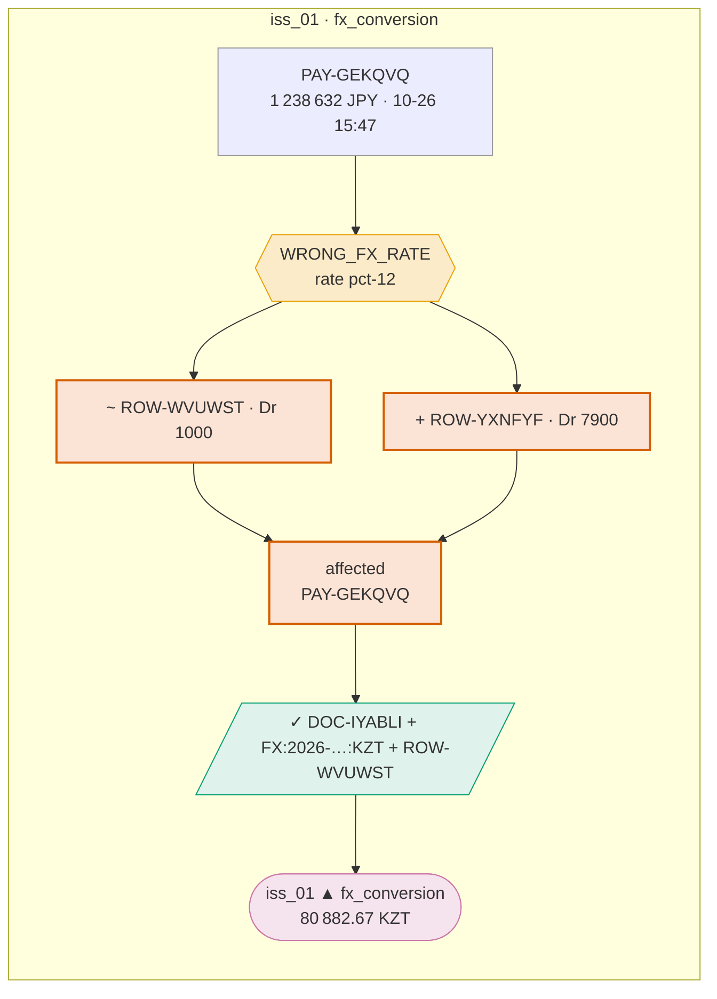
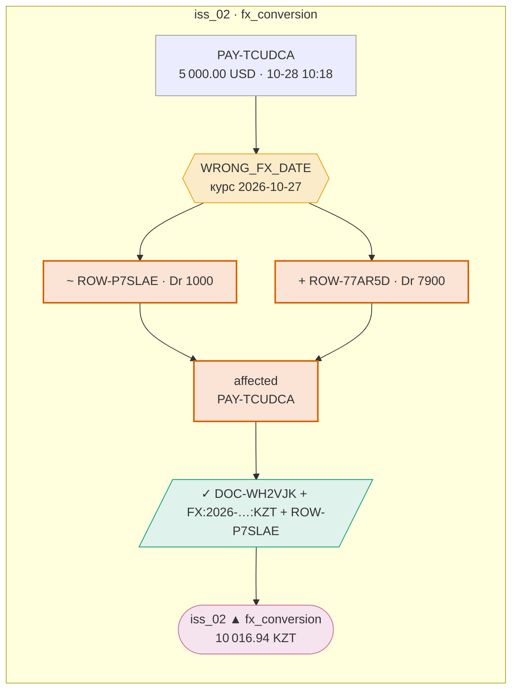
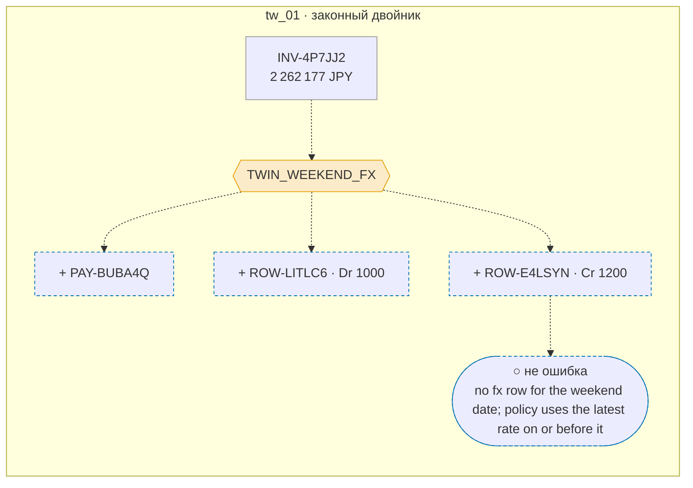

## Граф причинности · эпизод ep_b4d88a8b · 2 ошибок/групп · 1 двойников

```mermaid
flowchart LR
    classDef clean stroke:#999999
    classDef mut fill:#FCEBC8,stroke:#E69F00
    classDef err fill:#FBE3D6,stroke:#D55E00,stroke-width:2px
    classDef ev fill:#E0F2EC,stroke:#009E73
    classDef truth fill:#F5E3EE,stroke:#CC79A7
    classDef twin stroke:#0072B2,stroke-dasharray:4 3

    subgraph iss_01["iss_01 · fx_conversion"]
        iss_01_source_0["PAY-GEKQVQ<br/>1 238 632 JPY · 10-26 15:47"]:::clean
        iss_01_mutator_0{{"WRONG_FX_RATE<br/>rate pct-12"}}:::mut
        iss_01_diff_0["~ ROW-WVUWST · Dr 1000"]:::err
        iss_01_diff_1["+ ROW-YXNFYF · Dr 7900"]:::err
        iss_01_affected_0["affected<br/>PAY-GEKQVQ"]:::err
        iss_01_evidence_0[/"✓ DOC-IYABLI + FX:2026-…:KZT + ROW-WVUWST"/]:::ev
        iss_01_truth_0(["iss_01 ▲ fx_conversion<br/>80 882.67 KZT"]):::truth
        iss_01_source_0 --> iss_01_mutator_0
        iss_01_mutator_0 --> iss_01_diff_0
        iss_01_mutator_0 --> iss_01_diff_1
        iss_01_diff_0 --> iss_01_affected_0
        iss_01_diff_1 --> iss_01_affected_0
        iss_01_affected_0 --> iss_01_evidence_0
        iss_01_evidence_0 --> iss_01_truth_0
    end
```

```mermaid
flowchart LR
    classDef clean stroke:#999999
    classDef mut fill:#FCEBC8,stroke:#E69F00
    classDef err fill:#FBE3D6,stroke:#D55E00,stroke-width:2px
    classDef ev fill:#E0F2EC,stroke:#009E73
    classDef truth fill:#F5E3EE,stroke:#CC79A7
    classDef twin stroke:#0072B2,stroke-dasharray:4 3

    subgraph iss_02["iss_02 · fx_conversion"]
        iss_02_source_0["PAY-TCUDCA<br/>5 000.00 USD · 10-28 10:18"]:::clean
        iss_02_mutator_0{{"WRONG_FX_DATE<br/>курс 2026-10-27"}}:::mut
        iss_02_diff_0["~ ROW-P7SLAE · Dr 1000"]:::err
        iss_02_diff_1["+ ROW-77AR5D · Dr 7900"]:::err
        iss_02_affected_0["affected<br/>PAY-TCUDCA"]:::err
        iss_02_evidence_0[/"✓ DOC-WH2VJK + FX:2026-…:KZT + ROW-P7SLAE"/]:::ev
        iss_02_truth_0(["iss_02 ▲ fx_conversion<br/>10 016.94 KZT"]):::truth
        iss_02_source_0 --> iss_02_mutator_0
        iss_02_mutator_0 --> iss_02_diff_0
        iss_02_mutator_0 --> iss_02_diff_1
        iss_02_diff_0 --> iss_02_affected_0
        iss_02_diff_1 --> iss_02_affected_0
        iss_02_affected_0 --> iss_02_evidence_0
        iss_02_evidence_0 --> iss_02_truth_0
    end
```

```mermaid
flowchart LR
    classDef clean stroke:#999999
    classDef mut fill:#FCEBC8,stroke:#E69F00
    classDef err fill:#FBE3D6,stroke:#D55E00,stroke-width:2px
    classDef ev fill:#E0F2EC,stroke:#009E73
    classDef truth fill:#F5E3EE,stroke:#CC79A7
    classDef twin stroke:#0072B2,stroke-dasharray:4 3

    subgraph tw_01["tw_01 · законный двойник"]
        tw_01_source_0["INV-4P7JJ2<br/>2 262 177 JPY"]:::clean
        tw_01_mutator_0{{"TWIN_WEEKEND_FX<br/>"}}:::mut
        tw_01_diff_0["+ PAY-BUBA4Q"]:::twin
        tw_01_diff_1["+ ROW-LITLC6 · Dr 1000"]:::twin
        tw_01_diff_2["+ ROW-E4LSYN · Cr 1200"]:::twin
        tw_01_truth_0(["○ не ошибка<br/>no fx row for the weekend date; policy uses the latest rate on or before it"]):::twin
        tw_01_source_0 -.-> tw_01_mutator_0
        tw_01_mutator_0 -.-> tw_01_diff_0
        tw_01_mutator_0 -.-> tw_01_diff_1
        tw_01_mutator_0 -.-> tw_01_diff_2
        tw_01_diff_2 -.-> tw_01_truth_0
    end
```
