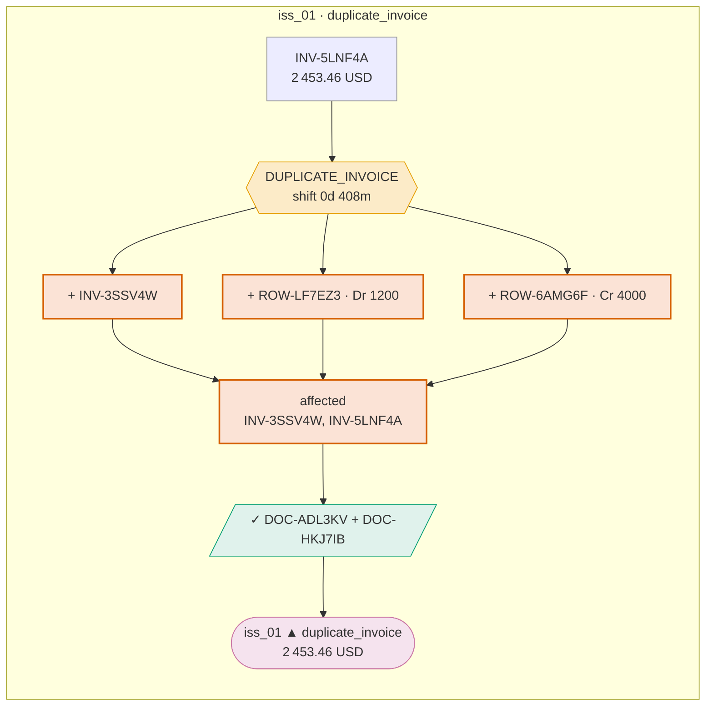
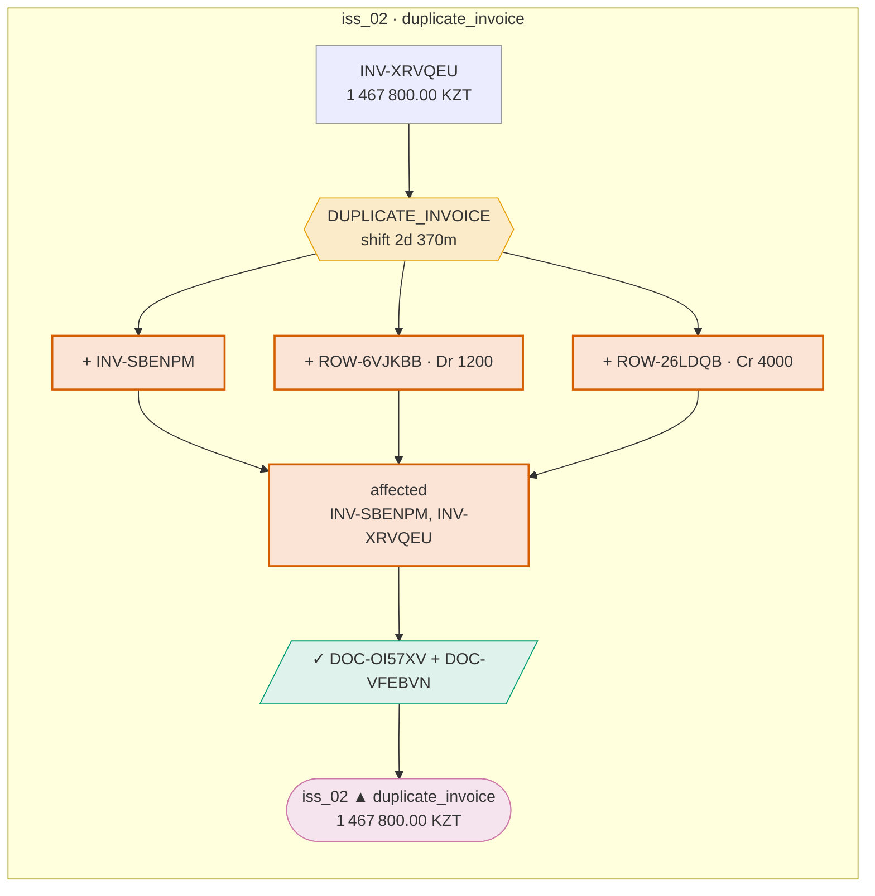
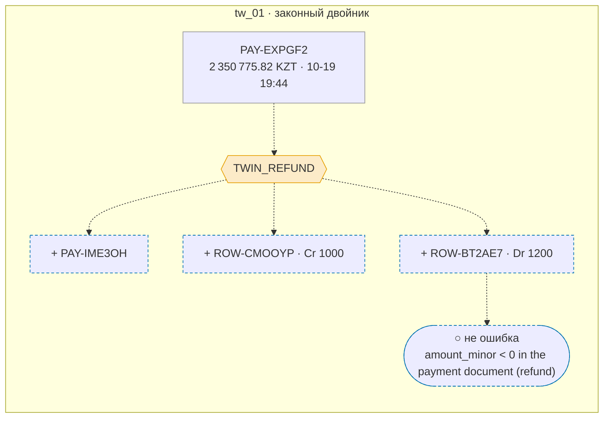
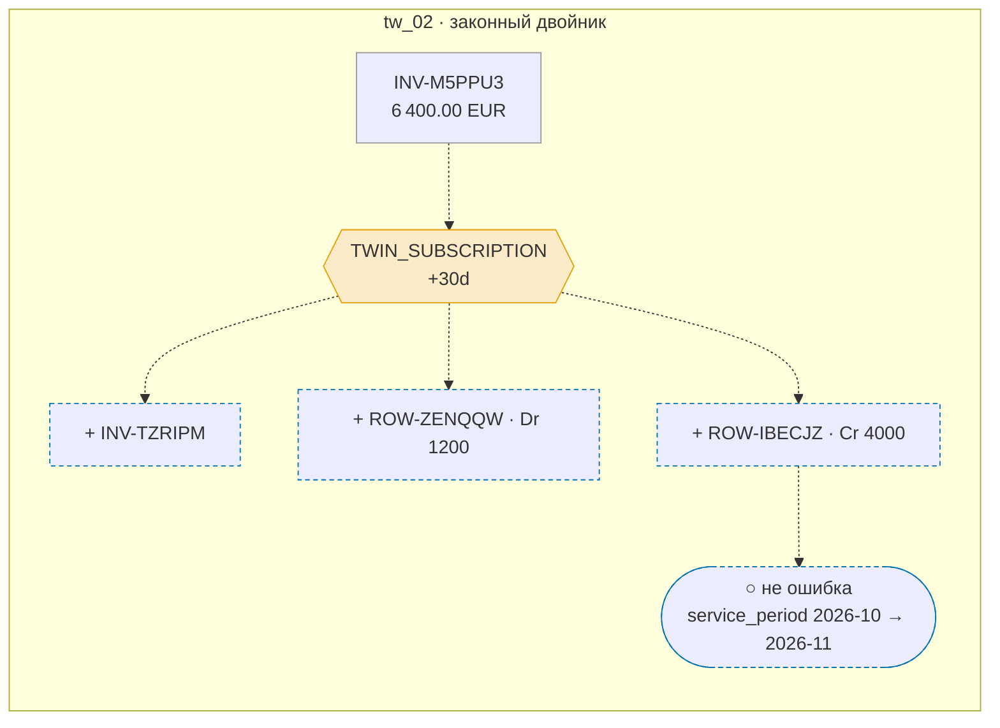

## Граф причинности · эпизод ep_f14cc06d · 2 ошибок/групп · 2 двойников

```mermaid
flowchart LR
    classDef clean stroke:#999999
    classDef mut fill:#FCEBC8,stroke:#E69F00
    classDef err fill:#FBE3D6,stroke:#D55E00,stroke-width:2px
    classDef ev fill:#E0F2EC,stroke:#009E73
    classDef truth fill:#F5E3EE,stroke:#CC79A7
    classDef twin stroke:#0072B2,stroke-dasharray:4 3

    subgraph iss_01["iss_01 · duplicate_invoice"]
        iss_01_source_0["INV-5LNF4A<br/>2 453.46 USD"]:::clean
        iss_01_mutator_0{{"DUPLICATE_INVOICE<br/>shift 0d 408m"}}:::mut
        iss_01_diff_0["+ INV-3SSV4W"]:::err
        iss_01_diff_1["+ ROW-LF7EZ3 · Dr 1200"]:::err
        iss_01_diff_2["+ ROW-6AMG6F · Cr 4000"]:::err
        iss_01_affected_0["affected<br/>INV-3SSV4W, INV-5LNF4A"]:::err
        iss_01_evidence_0[/"✓ DOC-ADL3KV + DOC-HKJ7IB"/]:::ev
        iss_01_truth_0(["iss_01 ▲ duplicate_invoice<br/>2 453.46 USD"]):::truth
        iss_01_source_0 --> iss_01_mutator_0
        iss_01_mutator_0 --> iss_01_diff_0
        iss_01_mutator_0 --> iss_01_diff_1
        iss_01_mutator_0 --> iss_01_diff_2
        iss_01_diff_0 --> iss_01_affected_0
        iss_01_diff_1 --> iss_01_affected_0
        iss_01_diff_2 --> iss_01_affected_0
        iss_01_affected_0 --> iss_01_evidence_0
        iss_01_evidence_0 --> iss_01_truth_0
    end
```

```mermaid
flowchart LR
    classDef clean stroke:#999999
    classDef mut fill:#FCEBC8,stroke:#E69F00
    classDef err fill:#FBE3D6,stroke:#D55E00,stroke-width:2px
    classDef ev fill:#E0F2EC,stroke:#009E73
    classDef truth fill:#F5E3EE,stroke:#CC79A7
    classDef twin stroke:#0072B2,stroke-dasharray:4 3

    subgraph iss_02["iss_02 · duplicate_invoice"]
        iss_02_source_0["INV-XRVQEU<br/>1 467 800.00 KZT"]:::clean
        iss_02_mutator_0{{"DUPLICATE_INVOICE<br/>shift 2d 370m"}}:::mut
        iss_02_diff_0["+ INV-SBENPM"]:::err
        iss_02_diff_1["+ ROW-6VJKBB · Dr 1200"]:::err
        iss_02_diff_2["+ ROW-26LDQB · Cr 4000"]:::err
        iss_02_affected_0["affected<br/>INV-SBENPM, INV-XRVQEU"]:::err
        iss_02_evidence_0[/"✓ DOC-OI57XV + DOC-VFEBVN"/]:::ev
        iss_02_truth_0(["iss_02 ▲ duplicate_invoice<br/>1 467 800.00 KZT"]):::truth
        iss_02_source_0 --> iss_02_mutator_0
        iss_02_mutator_0 --> iss_02_diff_0
        iss_02_mutator_0 --> iss_02_diff_1
        iss_02_mutator_0 --> iss_02_diff_2
        iss_02_diff_0 --> iss_02_affected_0
        iss_02_diff_1 --> iss_02_affected_0
        iss_02_diff_2 --> iss_02_affected_0
        iss_02_affected_0 --> iss_02_evidence_0
        iss_02_evidence_0 --> iss_02_truth_0
    end
```

```mermaid
flowchart LR
    classDef clean stroke:#999999
    classDef mut fill:#FCEBC8,stroke:#E69F00
    classDef err fill:#FBE3D6,stroke:#D55E00,stroke-width:2px
    classDef ev fill:#E0F2EC,stroke:#009E73
    classDef truth fill:#F5E3EE,stroke:#CC79A7
    classDef twin stroke:#0072B2,stroke-dasharray:4 3

    subgraph tw_01["tw_01 · законный двойник"]
        tw_01_source_0["PAY-EXPGF2<br/>2 350 775.82 KZT · 10-19 19:44"]:::clean
        tw_01_mutator_0{{"TWIN_REFUND<br/>"}}:::mut
        tw_01_diff_0["+ PAY-IME3OH"]:::twin
        tw_01_diff_1["+ ROW-CMOOYP · Cr 1000"]:::twin
        tw_01_diff_2["+ ROW-BT2AE7 · Dr 1200"]:::twin
        tw_01_truth_0(["○ не ошибка<br/>amount_minor #lt; 0 in the payment document (refund)"]):::twin
        tw_01_source_0 -.-> tw_01_mutator_0
        tw_01_mutator_0 -.-> tw_01_diff_0
        tw_01_mutator_0 -.-> tw_01_diff_1
        tw_01_mutator_0 -.-> tw_01_diff_2
        tw_01_diff_2 -.-> tw_01_truth_0
    end
```

```mermaid
flowchart LR
    classDef clean stroke:#999999
    classDef mut fill:#FCEBC8,stroke:#E69F00
    classDef err fill:#FBE3D6,stroke:#D55E00,stroke-width:2px
    classDef ev fill:#E0F2EC,stroke:#009E73
    classDef truth fill:#F5E3EE,stroke:#CC79A7
    classDef twin stroke:#0072B2,stroke-dasharray:4 3

    subgraph tw_02["tw_02 · законный двойник"]
        tw_02_source_0["INV-M5PPU3<br/>6 400.00 EUR"]:::clean
        tw_02_mutator_0{{"TWIN_SUBSCRIPTION<br/>+30d"}}:::mut
        tw_02_diff_0["+ INV-TZRIPM"]:::twin
        tw_02_diff_1["+ ROW-ZENQQW · Dr 1200"]:::twin
        tw_02_diff_2["+ ROW-IBECJZ · Cr 4000"]:::twin
        tw_02_truth_0(["○ не ошибка<br/>service_period 2026-10 → 2026-11"]):::twin
        tw_02_source_0 -.-> tw_02_mutator_0
        tw_02_mutator_0 -.-> tw_02_diff_0
        tw_02_mutator_0 -.-> tw_02_diff_1
        tw_02_mutator_0 -.-> tw_02_diff_2
        tw_02_diff_2 -.-> tw_02_truth_0
    end
```
